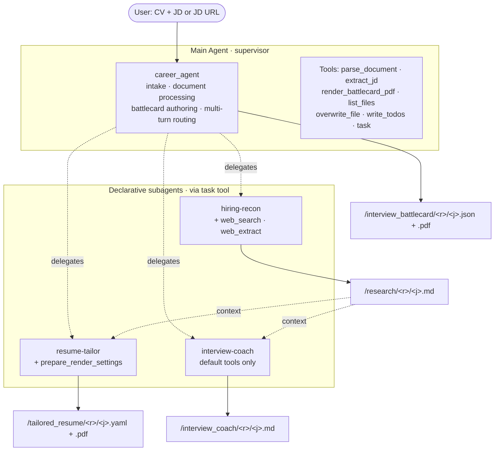
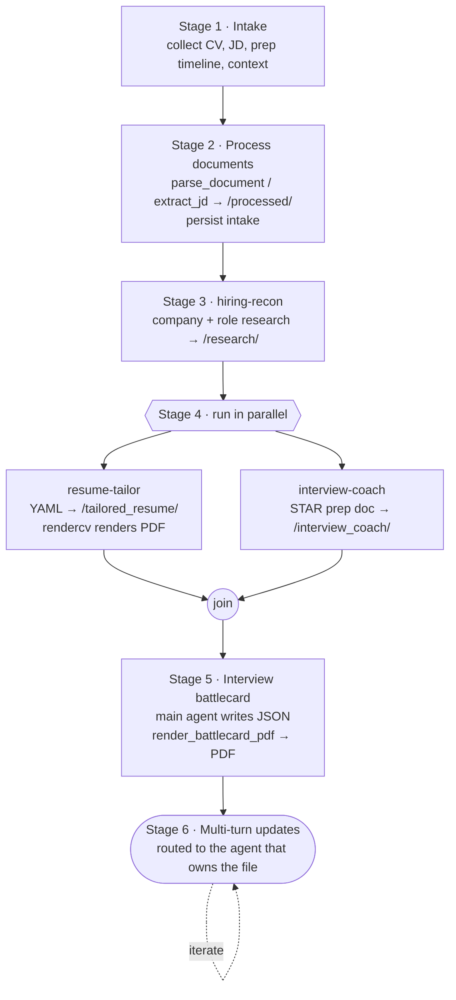
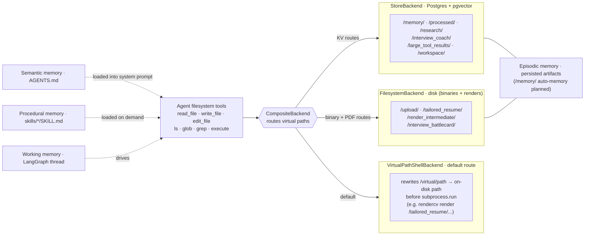
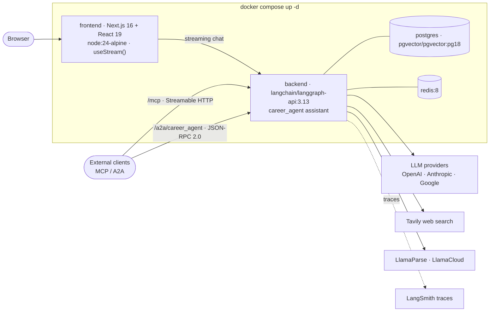

<div align="center">

<a href="https://github.com/tam159/next-role" target="_blank">
  <picture>
    
  </picture>
</a>

# NextRole 🚀

### ✨ GenAI-Accelerated Career Advancement ✨

**Upload your CV + a job description. Get a tailored resume PDF, a researched interview-prep doc, and a day-of battlecard cheat sheet — built by a multi-agent system with long-term memory.**

<!-- Row 1 · project -->


[](LICENSE)

[](https://github.com/tam159/next-role/stargazers)

<!-- Row 2 · AI stack -->


<!-- DEMO PLACEHOLDER — drop a 10-20s GIF (chat → files panel → PDF preview) at docs/images/demo.gif.
     This is the single highest-leverage asset; add it first.

-->

</div>

---

## What is NextRole?

Preparing for an interview takes hours of tedious resume tailoring and company research. **NextRole automates the heavy lifting.** Hand it your current CV and a target Job Description (or just a JD URL) — whether you're applying externally or angling for an internal move — and a team of specialized AI agents researches the company, rewrites your resume to fit, coaches you round-by-round, and prints a cheat sheet for the day of.

- 📄 **Tailored resume → PDF** — your experience rewritten against the exact JD + company research, rendered with [`rendercv`](https://github.com/rendercv/rendercv) (editable & re-renderable).
- 🔍 **Deep company & role recon** — live web research distilled into a match analysis.
- 🎯 **Structured interview prep** — a self-introduction plus per-round STAR stories mapped to the role.
- ⚡ **Day-of battlecard** — a one-page-per-round PDF cheat sheet for the final high-pressure review.
- 🗓️ **Time-boxed prep plans** — a study plan that fits 1 month, 2 weeks, or just 3 hours.
- 🔗 **Paste a JD URL** — point it at a careers page; it extracts and processes the posting for you.
- 💬 **Iterate by chatting** — "add a 4th round", "add React to my skills" — streaming multi-turn edits, with the right agent owning each file.
- 🗂️ **Built-in workspace** — upload, preview (PDF / MD / YAML / JSON / code), print-to-PDF, and swap the LLM at runtime.

## Demo

> 📸 _Screenshots coming soon._ In the meantime, run it locally in ~2 minutes (below) — chat on the left, a live workspace of generated files on the right, each downloadable as a polished PDF.

<!-- Suggested slots once captured:
| Chat & streaming | Workspace / files | Tailored resume PDF |
| --- | --- | --- |
|  |  |  |
-->

## Quick Start

The whole stack — frontend, backend, Postgres, Redis — runs in Docker.

```bash
# 1. Clone & configure
git clone https://github.com/tam159/next-role.git
cd next-role
cp .env.example .env          # then fill in your API keys (see table below)

# 2. Launch everything
docker compose up -d

# 3. Find your host ports (set in .env, vary per machine)
docker ps                     # read the 0.0.0.0:<host>->... mappings

# 4. Open the app
#    Frontend UI      →  http://localhost:<FRONTEND_LOCAL_PORT>/
#    Backend API docs →  http://localhost:<LANGGRAPH_LOCAL_PORT>/docs
```

> 💡 **Pick your LLM in the app.** Open the in-app **Configuration** dialog to set the main agent and subagent models — no rebuild needed. See **LLM configuration** below for recommended models and free / local options.

<details>
<summary><b>Environment variables</b> — what to put in <code>.env</code></summary>

<br/>

| Variable | Required | Purpose |
| --- | :---: | --- |
| `OPENAI_API_KEY` | ✅ | Default main + subagent models |
| `TAVILY_API_KEY` | ✅ | Web research (`hiring-recon`) |
| `LLAMA_CLOUD_API_KEY` | ✅ | Document parsing (LlamaParse) |
| `POSTGRES_PASSWORD` | ✅ | Local Postgres password |
| `ANTHROPIC_API_KEY` / `GOOGLE_API_KEY` | ⬜ | Alternative providers (swap at runtime) |
| `OPENAI_API_BASE` | ⬜ | Self-hosted / Azure / LM Studio endpoint |
| `AWS_ACCESS_KEY_ID` / `AWS_SECRET_ACCESS_KEY` / `AWS_DEFAULT_REGION` | ⬜ | AWS Bedrock models |
| `LANGCHAIN_API_KEY` + `LANGCHAIN_TRACING_V2=true` | ⬜ | LangSmith tracing (recommended) |
| `FRONTEND_LOCAL_PORT` / `LANGGRAPH_LOCAL_PORT` / `POSTGRES_LOCAL_PORT` / `REDIS_LOCAL_PORT` | preset | Host port mappings |

Secrets live only in `.env` (gitignored); `gitleaks` runs on every commit.

</details>

<details>
<summary><b>LLM configuration</b> — pick your models, run it for free or local</summary>

<br/>

Models are swappable **at runtime** — no rebuild. Open the in-app **Configuration** dialog and set **Main agent** / **Subagents** to a `<provider>:<model>` string (e.g. `anthropic:claude-sonnet-4.6`); leave blank to use the defaults. Settings persist in your browser's local storage.

**Recommended:** Claude Sonnet 4.x, GPT-5.x, or Gemini 3.x — e.g. `anthropic:claude-sonnet-4.6`, `openai:gpt-5.4`, `google_genai:gemini-3.5-flash`.

**Run it for free or fully local:**

- **Tavily** and **LlamaCloud** both include a generous monthly free tier — plenty for local use.
- **Google AI Studio** offers a free tier for Gemini `flash` / `lite` models.
- **Fully local** — point `OPENAI_API_BASE` at [LM Studio](https://lmstudio.ai/) or [Ollama](https://ollama.com/) (both expose an OpenAI-compatible API) and select your local model in the UI; `gpt-oss-20b` works well for the agent.

Output quality tracks the model you pick — smaller local models trade some quality for zero cost.

</details>

<details>
<summary><b>Dev workflow</b> — hot reload, restart, rebuild, stop</summary>

<br/>

- **Code edits** hot-reload in both containers — just save the file.
- **Add a frontend dep:** `pnpm --dir frontend add <pkg>` → `docker compose restart frontend`
- **Add a backend dep:** `uv add <pkg>` → `docker compose up -d --build backend`
- **Change `.env`:** `docker compose restart <service>`
- **Stop:** `docker compose down` (add `-v` to wipe the DB & Redis volumes)

</details>

## Architecture

NextRole is a **supervisor agent orchestrating three specialist subagents** on LangGraph + DeepAgents. The main agent handles intake, document processing, and the final battlecard; it delegates research, resume tailoring, and interview coaching to declarative subagents (defined in `subagents.yaml`, each with its own model, tools, and skills).



## How It Works

A five-stage pipeline. Stage 4 runs the resume tailor and interview coach **in parallel**; Stage 6 routes follow-up edits to whichever agent owns the target file.



<details>
<summary><b>Stage-by-stage detail</b></summary>

<br/>

1. **Intake** — the agent asks for your CV, the JD (file, URL, or pasted text), your prep timeline, and any extra context.
2. **Process documents** — uploads are parsed to markdown via LlamaParse (`parse_document`); JD URLs are pulled via Tavily (`extract_jd`). Results land in `/processed/`, alongside a persisted intake note.
3. **Research** — the `hiring-recon` subagent gathers company + role intel and a match analysis → `/research/<resume>/<jd>.md`.
4. **Tailor & coach (parallel)** — `resume-tailor` rewrites the CV as a `rendercv` YAML and renders a PDF; `interview-coach` writes a structured prep doc (self-intro + per-round STAR stories).
5. **Battlecard** — the main agent assembles a one-page-per-round JSON and renders it to a day-of PDF via WeasyPrint.
6. **Multi-turn updates** — ask for changes in chat; the owning agent reads the existing file, preserves everything you didn't name, and re-renders.

The full procedure (file layout, update routing, source-of-truth conventions) lives in **[`backend/app/career_agent/README.md`](backend/app/career_agent/README.md)**. Per-feature design docs are in **[`docs/prd/`](docs/prd/)**.

</details>

<details>
<summary><b>The DeepAgents stack</b> — an agent defined by filesystem primitives</summary>

<br/>

The agent's behavior is configured by files, not hardcoded — making it easy to read, diff, and extend:

| Primitive | Where | Role | When loaded |
| --- | --- | --- | --- |
| **Memory** | `AGENTS.md` | Per-stage procedure manual (semantic memory) | Always (system prompt) |
| **Skills** | `skills/<consumer>/<name>/SKILL.md` | Task workflows (procedural memory) | On demand, per consumer |
| **Subagents** | `subagents.yaml` | Specialist delegates → the `task` tool | Always |
| **Tools** | `tools.py` + DeepAgents built-ins | `parse_document`, `extract_jd`, `render_battlecard_pdf`, `prepare_render_settings`, `list_files`, `overwrite_file`, plus `read/write/edit_file`, `ls/glob/grep`, `execute` | — |
| **Filesystem** | `CompositeBackend` | Routes virtual paths to the right store (see below) | — |
| **Middleware** | `middleware.py` | `ModelOverrideMiddleware` (runtime LLM swap) + `UtcDatetimeMiddleware` | — |

Subagents only receive the tools they opt into in YAML — tool whitelisting keeps `interview-coach`, for example, from inheriting the main agent's full toolset.

</details>

<details>
<summary><b>Memory &amp; storage architecture</b></summary>

<br/>

A single `CompositeBackend` gives the agent one virtual filesystem while routing each path prefix to the right physical store — Postgres for text artifacts, disk for binaries and render outputs, and a shell backend that translates virtual paths to real ones before running commands like `rendercv render`.



Mapped to memory types:

- **Working memory** — the live LangGraph conversation thread.
- **Semantic memory** — `AGENTS.md`, always in the system prompt.
- **Procedural memory** — `skills/*/SKILL.md`, loaded on demand.
- **Episodic memory** — persisted artifacts in Postgres + disk. Per-user *auto-memory* (personalization via the `/memory/` route) is on the [roadmap](#roadmap).

</details>

<details>
<summary><b>Tech stack</b></summary>

<br/>

| Layer | Stack |
| --- | --- |
| **Backend** | Python 3.13 · LangChain v1 · LangGraph 1.x · DeepAgents 0.6 · `uv` · served on `langchain/langgraph-api:3.13` |
| **Agent I/O** | Tavily (web search) · LlamaParse / LlamaCloud (document parsing) · `rendercv` (resume → PDF) · WeasyPrint (battlecard → PDF) |
| **Frontend** | Next.js 16 · React 19 · TypeScript · Tailwind · `pnpm` · `@langchain/langgraph-sdk` (`useStream`) |
| **Data** | PostgreSQL 18 + pgvector · Redis 8 |
| **Infra** | Docker Compose (frontend · backend · postgres · redis) |
| **Observability** | LangSmith |

</details>

<details>
<summary><b>Expose the agent</b> — MCP &amp; A2A</summary>

<br/>

Because NextRole runs on the **LangGraph Agent Server**, the `career_agent` assistant is also reachable by other tools and agents — no extra code:

- **MCP** — exposed as Model Context Protocol tools at **`/mcp`** (Streamable HTTP), usable by any MCP-compliant client. → [docs](https://docs.langchain.com/langsmith/server-mcp)
- **A2A** — Google's Agent2Agent protocol at **`/a2a/{assistant_id}`** (JSON-RPC 2.0; `message/send` + `message/stream`). → [docs](https://docs.langchain.com/langsmith/server-a2a)
- The full server API is browsable at the **`/docs`** endpoint of your deployment.



</details>

<details>
<summary><b>Observability</b> — LangSmith tracing</summary>

<br/>

Set `LANGCHAIN_API_KEY` and `LANGCHAIN_TRACING_V2=true` in `.env`, and every run — each LLM call, tool call, and nested subagent — is traced at [smith.langchain.com](https://smith.langchain.com/) under the `LANGCHAIN_PROJECT` you configure. Optional, but invaluable for debugging the multi-agent flow.

</details>

## Roadmap

- 🧠 **Auto-memory & personalization** — populate the `/memory/` route so the agent learns your style, history, and preferences and auto-applies them across sessions.
- 💤 **"Auto-dream" consolidation** — sleep-time compaction that prunes stale notes and merges insights into durable memory.
- 📦 **Remote sandboxes** — swap `LocalShellBackend` for an isolated remote sandbox (e.g. [Daytona](https://www.daytona.io/)) so render/shell steps are safe for multi-tenant use.
- 📊 **Agent evaluation** — LangSmith evals over the workflow (the `@pytest.mark.eval` marker is already reserved).
- 🎨 **Enhanced UI** — richer artifact editing, diff views, and inline regeneration.
- 🔌 **MCP / A2A examples** — sample integrations driving `career_agent` from external agents and IDEs.
- 🧵 **Per-thread / multi-user scoping** — namespace artifacts per user instead of the current global layout.
- 🌐 **More sources & ATS-aware tailoring** — pluggable retrievers + keyword/ATS optimization passes.

## Limitations

> NextRole is built for **local, single-user, trusted use** today.

- 🔒 **Local shell execution** — `VirtualPathShellBackend` runs render commands via `subprocess` on the host. Safe locally; **not** hardened for multi-tenant production (needs sandboxing — see roadmap).
- 👤 **Global file scoping** — uploads and artifacts share one filesystem layout; re-uploading a filename overwrites. No per-user isolation yet.
- 🧪 **LLM evals deferred** — current tests are unit + local-DB integration; automated quality evals aren't wired up yet.
- 🧠 **No cross-session personalization yet** — memory persists within a project (conversation threads + artifacts in Postgres), but the agent doesn't yet learn your style and history and auto-apply them to brand-new chats; the `/memory/` auto-memory route is on the roadmap.
- ⏱️ **Latency** — a full run makes several LLM and tool calls across multiple agents; expect minutes, not seconds.

## Contributing

PRs and issues are welcome. Dev setup and conventions live in [`backend/CLAUDE.md`](backend/CLAUDE.md) and [`frontend/CLAUDE.md`](frontend/CLAUDE.md); commits follow [Conventional Commits](https://www.conventionalcommits.org/).

## License

[MIT](LICENSE) © 2026 Tam Nguyen

## Acknowledgements

Built on [DeepAgents](https://github.com/langchain-ai/deepagents), [LangChain / LangGraph / LangSmith](https://github.com/langchain-ai), [rendercv](https://github.com/rendercv/rendercv), [WeasyPrint](https://github.com/Kozea/WeasyPrint), [Tavily](https://tavily.com/), and [LlamaIndex / LlamaParse](https://github.com/run-llama/llama_index).
