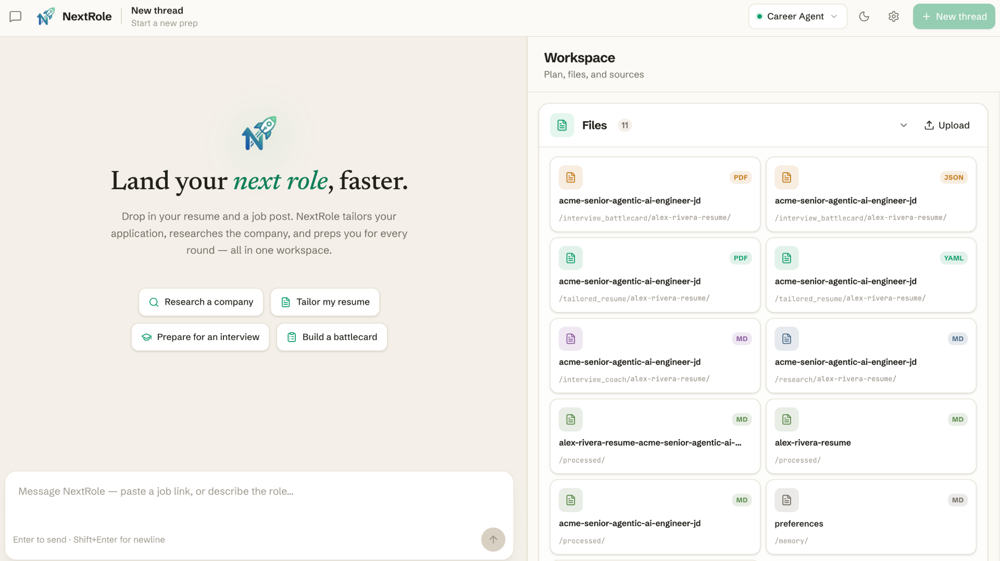
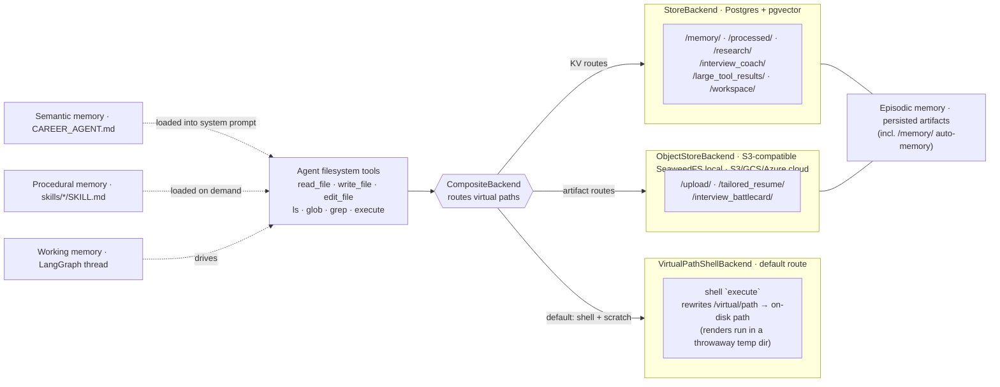

<div align="center">

<a href="https://github.com/tam159/next-role" target="_blank">
  <picture>
    
  </picture>
</a>

# NextRole 🚀

### ✨ GenAI-Accelerated Career Advancement ✨

**Upload your CV + a job description. Get a tailored resume PDF, a researched interview-prep doc, and a day-of battlecard cheat sheet — built by a multi-agent system with long-term memory.**

<!-- Row 1 · project -->


[](LICENSE)

[](https://github.com/tam159/next-role/stargazers)

<!-- Row 2 · AI stack -->


<br/>



</div>

---

## What is NextRole?

Preparing for an interview takes hours of tedious resume tailoring and company research. **NextRole automates the heavy lifting.** Hand it your current CV and a target Job Description (or just a JD URL) — whether you're applying externally or angling for an internal move — and a team of specialized AI agents researches the company, rewrites your resume to fit, coaches you round-by-round, and prints a cheat sheet for the day of.

- 📄 **Tailored resume → PDF** — your experience rewritten against the exact JD + company research, rendered with [`rendercv`](https://github.com/rendercv/rendercv) (editable & re-renderable).
- 🔍 **Deep company & role recon** — live web research distilled into a match analysis.
- 🎯 **Structured interview prep** — a self-introduction plus per-round STAR stories mapped to the role.
- ⚡ **Day-of battlecard** — a one-page-per-round PDF cheat sheet for the final high-pressure review.
- 🗓️ **Time-boxed prep plans** — a study plan that fits 1 month, 2 weeks, or just 3 hours.
- 🔗 **Paste a JD URL** — point it at a careers page; it extracts and processes the posting for you.
- 💬 **Iterate by chatting** — "add a 4th round", "add React to my skills" — streaming multi-turn edits, with the right agent owning each file.
- 🗂️ **Built-in workspace** — upload, preview (PDF / MD / YAML / JSON / code), print-to-PDF, and swap the LLM at runtime.

## Demo

<video src="https://github.com/user-attachments/assets/103b13fb-931f-4258-a131-4f6329b14f8d" width="100%" controls>
  Your browser does not support the video tag.
</video>

▶️ **[Watch the full walkthrough in HD on YouTube »](https://youtu.be/EItEczXPu0Y)**

## Quick Start

The whole stack — frontend, backend, Postgres, Redis, S3-compatible object storage — runs in Docker.

```bash
# 1. Clone & configure
git clone https://github.com/tam159/next-role.git
cd next-role
cp .env.example .env          # then fill in your API keys (see table below)

# 2. Launch everything
docker compose up -d

# 3. Find your host ports (set in .env, vary per machine)
docker ps                     # read the 0.0.0.0:<host>->... mappings

# 4. Open the app
#    Frontend UI      →  http://localhost:<FRONTEND_LOCAL_PORT>/
#    Backend API docs →  http://localhost:<LANGGRAPH_LOCAL_PORT>/docs
```

> 💡 **Pick your LLM in the app.** Open the in-app **Configuration** dialog to set the main agent and subagent models — no rebuild needed. See **LLM configuration** below for recommended models and free / local options.

<details>
<summary><b>Environment variables</b> — what to put in <code>.env</code></summary>

<br/>

| Variable | Required | Purpose |
| --- | :---: | --- |
| `OPENAI_API_KEY` | ✅ | Default main + subagent models |
| `TAVILY_API_KEY` | ✅ | Web research (`hiring-recon`) |
| `LLAMA_CLOUD_API_KEY` | ✅ | Document parsing (LlamaParse) |
| `POSTGRES_PASSWORD` | ✅ | Local Postgres password |
| `ANTHROPIC_API_KEY` / `GOOGLE_API_KEY` | ⬜ | Alternative providers (swap at runtime) |
| `OPENAI_API_BASE` | ⬜ | Self-hosted / Azure / LM Studio endpoint |
| `AWS_ACCESS_KEY_ID` / `AWS_SECRET_ACCESS_KEY` / `AWS_DEFAULT_REGION` | ⬜ | AWS Bedrock models |
| `LANGCHAIN_API_KEY` + `LANGCHAIN_TRACING_V2=true` | ⬜ | LangSmith tracing (recommended) |
| `AUTH_ENABLED` / `BETTER_AUTH_SECRET` / `LANGGRAPH_AUTH` | ⬜ | Multi-user auth (opt-in) — steps in [Authentication & multi-user](#authentication--multi-user) |
| `FRONTEND_LOCAL_PORT` / `LANGGRAPH_LOCAL_PORT` / `POSTGRES_LOCAL_PORT` / `REDIS_LOCAL_PORT` / `OBJECT_STORE_LOCAL_PORT` | preset | Host port mappings |
| `OBJECT_STORE_*` | preset | Artifact object storage — see below |

**Object storage.** Binary artifacts (uploads + rendered PDFs) live in S3-compatible object storage. Locally that's the compose `object-store` service (SeaweedFS) and the presets work as-is: S3 API on `OBJECT_STORE_LOCAL_PORT`, a browsable bucket UI on `OBJECT_STORE_UI_LOCAL_PORT`, and placeholder credentials that the local emulator accepts but doesn't enforce. For the cloud, point `OBJECT_STORE_ENDPOINT` / `OBJECT_STORE_BUCKET` / credentials at a managed bucket — AWS S3, GCS, Azure, or any S3-compatible store — with no code changes. Note: the `AWS_*` variables are reserved for Bedrock models; the object store reads only `OBJECT_STORE_*`.

Secrets live only in `.env` (gitignored); `gitleaks` runs on every commit.

</details>

<details>
<summary><b>LLM configuration</b> — pick your models, run it for free or local</summary>

<br/>

Models are swappable **at runtime** — no rebuild. Open the in-app **Configuration** dialog and set **Main agent** / **Subagents** to a `<provider>:<model>` string (e.g. `anthropic:claude-sonnet-5`); leave blank to use the defaults. Settings persist in your browser's local storage.

**Recommended:** Claude Sonnet 5, GPT-5.x, or Gemini 3.x — e.g. `anthropic:claude-sonnet-5`, `openai:gpt-5.6-terra`, `google_genai:gemini-3.5-flash`.

**Run it for free or fully local:**

- **Tavily** and **LlamaCloud** both include a generous monthly free tier — plenty for local use.
- **Google AI Studio** offers a free tier for Gemini `flash` / `lite` models.
- **Fully local** — point `OPENAI_API_BASE` at [LM Studio](https://lmstudio.ai/) or [Ollama](https://ollama.com/) (both expose an OpenAI-compatible API) and fill your local model in the UI.

Output quality tracks the model you pick — smaller local models trade some quality for zero cost.

</details>

<details>
<summary><b>Dev workflow</b> — hot reload, restart, rebuild, stop</summary>

<br/>

- **Code edits** hot-reload in both containers — just save the file.
- **Add a frontend dep:** `pnpm --dir frontend add <pkg>` → `docker compose restart frontend`
- **Add a backend dep:** `uv add <pkg>` → `docker compose up -d --build backend`
- **Change `.env`:** `docker compose restart <service>`
- **Stop:** `docker compose down` (add `-v` to wipe the DB, Redis & object-storage volumes)

</details>

## Architecture

NextRole is a **supervisor agent orchestrating three specialist subagents** on LangGraph + DeepAgents. The main agent handles intake, document processing, and the final battlecard; it delegates research, resume tailoring, and interview coaching to declarative subagents (defined in `subagents.yaml`, each with its own model, tools, and skills).


## How It Works

A five-stage pipeline. Stage 4 runs the resume tailor and interview coach **in parallel**; Stage 6 routes follow-up edits to whichever agent owns the target file.


<details>
<summary><b>Stage-by-stage detail</b></summary>

<br/>

1. **Intake** — the agent asks for your CV, the JD (file, URL, or pasted text), your prep timeline, and any extra context.
2. **Process documents** — uploads are parsed to markdown via LlamaParse (`parse_document`); JD URLs are pulled via Tavily (`extract_jd`). Results land in `/processed/`, alongside a persisted intake note.
3. **Research** — the `hiring-recon` subagent gathers company + role intel and a match analysis → `/research/<resume>/<jd>.md`.
4. **Tailor & coach (parallel)** — `resume-tailor` rewrites the CV as a `rendercv` YAML and renders a PDF; `interview-coach` writes a structured prep doc (self-intro + per-round STAR stories).
5. **Battlecard** — the main agent assembles a one-page-per-round JSON and renders it to a day-of PDF via WeasyPrint.
6. **Multi-turn updates** — ask for changes in chat; the owning agent reads the existing file, preserves everything you didn't name, and re-renders.

The full procedure (file layout, update routing, source-of-truth conventions) lives in **[`backend/agents/career_agent/README.md`](backend/agents/career_agent/README.md)**. Per-feature design docs are in **[`docs/prd/`](docs/prd/)**.

</details>

<details>
<summary><b>The DeepAgents stack</b> — an agent defined by filesystem primitives</summary>

<br/>

The agent's behavior is configured by files, not hardcoded — making it easy to read, diff, and extend:

| Primitive | Where | Role | When loaded |
| --- | --- | --- | --- |
| **Memory** | `CAREER_AGENT.md` | Per-stage procedure manual (semantic memory) | Always (system prompt) |
| **Skills** | `skills/<consumer>/<name>/SKILL.md` | Task workflows (procedural memory) | On demand, per consumer |
| **Subagents** | `subagents.yaml` | Specialist delegates → the `task` tool | Always |
| **Tools** | `tools.py` + DeepAgents built-ins | `parse_document`, `extract_jd`, `render_resume_pdf`, `render_battlecard_pdf`, `list_files`, `overwrite_file`, plus `read/write/edit_file`, `ls/glob/grep`, `execute` | — |
| **Filesystem** | `CompositeBackend` | Routes virtual paths to the right store (see below) | — |
| **Middleware** | `middleware.py` | `ModelOverrideMiddleware` (runtime LLM swap) + `UtcDatetimeMiddleware` | — |

Subagents only receive the tools they opt into in YAML — tool whitelisting keeps `interview-coach`, for example, from inheriting the main agent's full toolset.

</details>

<details>
<summary><b>Memory &amp; storage architecture</b></summary>

<br/>

A single `CompositeBackend` gives the agent one virtual filesystem while routing each path prefix to the right physical store — Postgres for text artifacts, S3-compatible object storage for uploads and rendered PDFs (SeaweedFS locally; S3 / GCS / Azure in the cloud), and a shell backend whose disk holds only render scratch and translates virtual paths to real ones before running commands like `rendercv render`.



Mapped to memory types:

- **Working memory** — the live LangGraph conversation thread.
- **Semantic memory** — `CAREER_AGENT.md`, always in the system prompt.
- **Procedural memory** — `skills/*/SKILL.md`, loaded on demand.
- **Episodic memory** — persisted artifacts in Postgres + disk, including *auto-memory*: standing preferences saved to the `/memory/` route and auto-applied across sessions.

</details>

<a name="authentication--multi-user"></a>

<details>
<summary><b>Authentication &amp; multi-user</b> — opt-in login &amp; per-user isolation</summary>

<br/>

NextRole runs **zero-login single-user by default** — `docker compose up` and start prepping, no accounts. Flip on **multi-user mode** for a shared or cloud deployment and every user gets private threads, files, and memory.

- **Login** — Google OAuth and/or email + password, via self-hosted [Better Auth](https://better-auth.com) inside the Next.js app (its tables live in your Postgres; no third-party auth vendor).
- **Isolation** — the agent server verifies a short-lived JWT (JWKS) on every request; threads/runs/crons are owner-scoped in SQL (unowned → `404`), and store namespaces + object keys are scoped per user (`users/<id>/…`). Design details in [`backend/ARCHITECTURE.md` §8](backend/ARCHITECTURE.md#8-authentication--multi-user).

**Enable it** — set these in `.env`, then `docker compose up -d frontend backend`:

1. `AUTH_ENABLED=true` and `BETTER_AUTH_SECRET=$(openssl rand -base64 32)`.
2. Create the Better Auth tables once (it owns `user` / `session` / `account` / `jwks`, separate from `backend/storage/migrations/`):
   ```bash
   AUTH_DATABASE_URL="postgresql://<POSTGRES_USER>:<POSTGRES_PASSWORD>@localhost:<POSTGRES_LOCAL_PORT>/<POSTGRES_DB>" \
   BETTER_AUTH_SECRET=<same secret> \
     pnpm --dir frontend dlx @better-auth/cli@latest migrate --config src/lib/auth/server.ts
   ```
3. `LANGGRAPH_AUTH={"path": "/deps/next-role/backend/agents/auth.py:auth", "disable_studio_auth": true}` — turns on backend enforcement. (Login without this is fine for trying the UI, but provides no isolation.)
4. *Optional Google sign-in:* `AUTH_GOOGLE_ENABLED=true` + `GOOGLE_AUTH_CLIENT_ID` / `GOOGLE_AUTH_CLIENT_SECRET` (OAuth client redirect URI `http://localhost:<FRONTEND_LOCAL_PORT>/api/auth/callback/google`). Email + password works without it.

<details>
<summary><b>Cloud hardening checklist</b> — beyond enabling auth</summary>

<br/>

- **`REQUIRE_AUTH=true`** — the backend refuses to boot if `LANGGRAPH_AUTH` is missing, so a misconfigured deploy fails loudly instead of serving everyone's data.
- **HTTPS everywhere** — set `BETTER_AUTH_URL` / `AUTH_JWT_ISSUER` / `AUTH_JWT_AUDIENCE` to the public https origin, and `AUTH_JWKS_URL` to the in-network frontend URL the backend can reach.
- **Pin CORS** — `CORS_ALLOW_ORIGINS=https://your-frontend.example` (the default `*` is local-only).
- **Block the unauthenticated meta routes** at the ingress — `/metrics` leaks thread/run counts; also `/docs`, `/openapi.json`, `/info`.
- **Gate MCP / A2A** — authentication-only today (no per-resource authz), so disable via `LANGGRAPH_HTTP` `"disable_mcp": true` / `"disable_a2a": true` until audited.
- **Close the Studio backdoors** — never set `LANGSMITH_LANGGRAPH_API_VARIANT=local_dev` in production; `disable_studio_auth: true` (above) closes the header-based one.
- **Reverse proxy** must never forward a client-controlled root_path (the in-process `/noauth` loopback bypass stays internal-only).

</details>

</details>

<details>
<summary><b>Tech stack</b></summary>

<br/>

| Layer | Stack |
| --- | --- |
| **Backend** | Python 3.13 · LangChain v1 · LangGraph 1.x · DeepAgents 0.6 · `uv` · served by NextRole's own self-hosted agent server ([`backend/ARCHITECTURE.md`](backend/ARCHITECTURE.md)) |
| **Agent I/O** | Tavily (web search) · LlamaParse / LlamaCloud (document parsing) · `rendercv` (resume → PDF) · WeasyPrint (battlecard → PDF) |
| **Frontend** | Next.js 16 · React 19 · TypeScript · Tailwind · `pnpm` · `@langchain/react` (v2 `useStream`) |
| **Data** | PostgreSQL 18 + pgvector · Redis 8 · S3-compatible object storage (SeaweedFS locally; S3 / GCS / Azure in the cloud) |
| **Infra** | Docker Compose (frontend · backend · core-server · postgres · redis · object-store) |
| **Observability** | LangSmith |

</details>

<details>
<summary><b>Expose the agent</b> — MCP &amp; A2A</summary>

<br/>

Because NextRole ships its own **agent server** implementing the LangGraph Server API (see [`backend/ARCHITECTURE.md`](backend/ARCHITECTURE.md)), the `career_agent` assistant is also reachable by other tools and agents — no extra code:

- **MCP** — exposed as Model Context Protocol tools at **`/mcp`** (Streamable HTTP), usable by any MCP-compliant client. → [docs](https://docs.langchain.com/langsmith/server-mcp)
- **A2A** — Google's Agent2Agent protocol at **`/a2a/{assistant_id}`** (JSON-RPC 2.0; `message/send` + `message/stream`). → [docs](https://docs.langchain.com/langsmith/server-a2a)
- The full server API is browsable at the **`/docs`** endpoint of your deployment.

> In multi-user mode these endpoints are authentication-gated but not yet per-user authorized — disable them (`disable_mcp` / `disable_a2a`) in a shared deployment until that lands. See [`backend/ARCHITECTURE.md` §8](backend/ARCHITECTURE.md#8-authentication--multi-user).


</details>

<details>
<summary><b>Observability</b> — LangSmith tracing</summary>

<br/>

Set `LANGCHAIN_API_KEY` and `LANGCHAIN_TRACING_V2=true` in `.env`, and every run — each LLM call, tool call, and nested subagent — is traced at [smith.langchain.com](https://smith.langchain.com/) under the `LANGCHAIN_PROJECT` you configure. Optional, but invaluable for debugging the multi-agent flow.

</details>

## Roadmap

- 💤 **"Auto-dream" consolidation** — sleep-time compaction that prunes stale notes and merges insights into durable memory.
- 📦 **Remote sandboxes** — swap `LocalShellBackend` for an isolated remote sandbox (e.g. [Daytona](https://www.daytona.io/)) so render/shell steps are safe for multi-tenant use.
- 📊 **Agent evaluation** — LangSmith evals over the workflow (the `@pytest.mark.eval` marker is already reserved).
- 🎨 **Enhanced UI** — richer artifact editing, diff views, and inline regeneration.
- 🔌 **MCP / A2A examples** — sample integrations driving `career_agent` from external agents and IDEs.
- ☁️ **Cloud deployment** — binary artifacts already live in S3-compatible object storage (SeaweedFS locally; point `OBJECT_STORE_*` at S3 / GCS / Azure). Remaining: managed bucket provisioning (versioning, SSE, IAM) and presigned-URL delivery.
- 🌐 **More sources & ATS-aware tailoring** — pluggable retrievers + keyword/ATS optimization passes.

## Limitations

> Multi-user mode isolates data, but the shell sandbox below is still the gate before opening signups to untrusted users.

- 🔒 **Local shell execution** — `VirtualPathShellBackend` runs render commands via `subprocess` on the host. Safe locally and for a trusted team; **not** hardened for untrusted multi-tenant use (needs sandboxing — see roadmap). Isolate render/shell steps before exposing public signup.
- 🧪 **LLM evals deferred** — current tests are unit + local-DB integration; automated quality evals aren't wired up yet.
- 🧠 **Personalization is preferences-only** — the agent persists and auto-applies the preferences you *state* across sessions, but doesn't yet infer your style/history on its own or consolidate memory over time (see [roadmap](#roadmap)).
- ⏱️ **Latency** — a full run makes several LLM and tool calls across multiple agents; expect minutes, not seconds.

## 🗺️ Explore the codebase graph

This repo ships a pre-built architecture knowledge graph in [`.ua/`](.ua) — the whole codebase (445 files) mapped by [Understand-Anything](https://github.com/Egonex-AI/Understand-Anything) into 1,100+ nodes across 10 architectural layers, with a guided tour. Browse it as an interactive dashboard:

<details>
<summary><b>Open the dashboard</b> — one command, nothing to install</summary>

<br/>

```bash
# From the repo root — needs only Node.js (no install, no clone, no build):
npx --yes "https://github.com/Egonex-AI/Understand-Anything/releases/latest/download/understand-anything-viewer.tgz" .
```

Open the printed `🔑 Dashboard URL` (include the `?token=…` — the plain URL hits an access gate).

> Using Claude Code? Install the [understand-anything](https://github.com/Egonex-AI/Understand-Anything) plugin and run `/understand-dashboard` in this repo instead.

The graph is **for humans**: AI coding assistants are configured to ignore `.ua/` (Claude Code deny rules, `.cursorignore`, a `CLAUDE.md` instruction) so they keep reading the real source instead of a large generated snapshot.

</details>

## Contributing

PRs and issues are welcome! Start with **[`CONTRIBUTING.md`](CONTRIBUTING.md)** — it walks through the fork → PR workflow, local setup, the CI quality gate (code quality + backend tests + frontend tests), testing, and conventions. Stack-specific details live in [`backend/CLAUDE.md`](backend/CLAUDE.md) and [`frontend/CLAUDE.md`](frontend/CLAUDE.md); commits follow [Conventional Commits](https://www.conventionalcommits.org/).

New here? Issues labelled [`good first issue`](https://github.com/tam159/next-role/labels/good%20first%20issue) are a gentle place to start, and questions are welcome in [Discussions](https://github.com/tam159/next-role/discussions).

## License

[MIT](LICENSE) © 2026 Tam Nguyen

## Acknowledgements

Built on [DeepAgents](https://github.com/langchain-ai/deepagents), [LangChain / LangGraph / LangSmith](https://github.com/langchain-ai), [rendercv](https://github.com/rendercv/rendercv), [WeasyPrint](https://github.com/Kozea/WeasyPrint), [Tavily](https://tavily.com/), and [LlamaIndex / LlamaParse](https://github.com/run-llama/llama_index).
