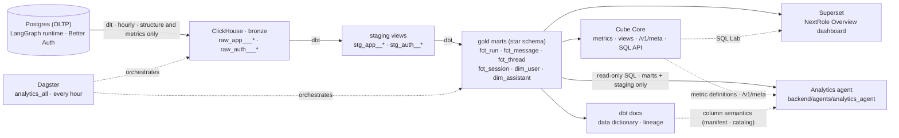
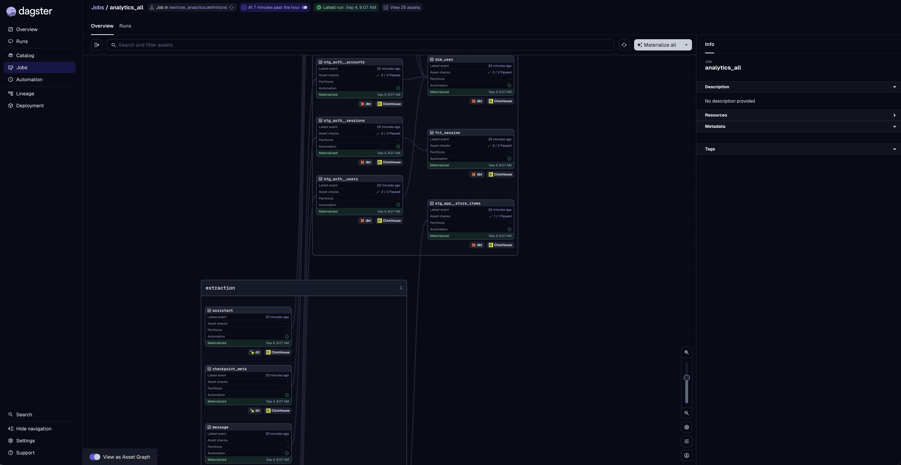
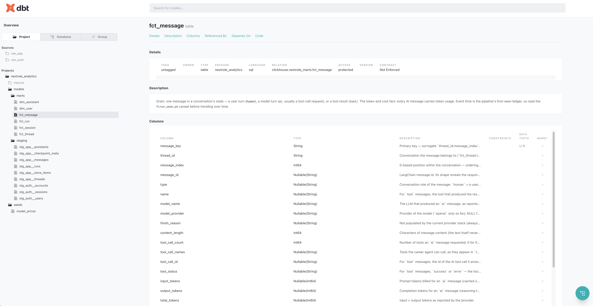
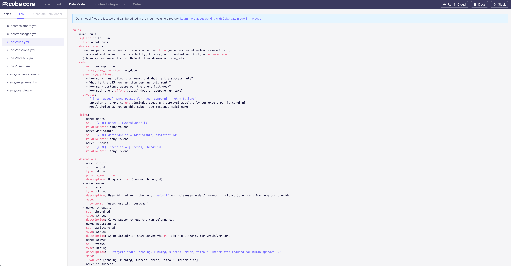
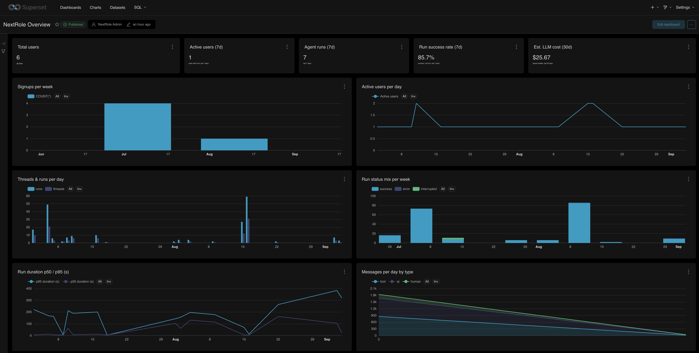

# NextRole Analytics

The analytics platform behind NextRole: it turns the career agent's operational data (users,
conversations, agent runs, tool calls, tokens) into governed metrics and dashboards, and lays the
metadata foundation for an analytics agent that will answer questions about the product in natural
language. It is Phase 0 of the [analytics platform blueprint](../docs/ideas/analytics-platform-plan.html):
one open-source stack, the same containers from laptop to production, chosen so nothing has to be
migrated later.

> This page is the overview for people and AI assistants. The working guide — tooling, layout,
> dev loop, warehouse gotchas — is [`CLAUDE.md`](CLAUDE.md).

## Architecture

Five principles from the blueprint shape every layer:

1. **ELT, not ETL.** Raw structure lands in ClickHouse bronze as-is; dbt does the shaping inside
   the warehouse, so the app's JSON can evolve without breaking extractors.
2. **One stack you operate.** ClickHouse, Dagster, dbt, Cube and Superset are the stack from the
   first commit — dev and prod differ by hardware, not dialect.
3. **The warehouse is the source of truth**; BI and (later) the agent are lenses over the same marts.
4. **Governance rides the pipeline.** Descriptions, PII tags, tests and lineage are emitted by dbt
   and Dagster, not documented by hand.
5. **Structure and metrics, never document bodies.** See [Privacy by construction](#privacy-by-construction).

## A tour of the platform

### Orchestration — Dagster

One job, `analytics_all`, materialises the whole asset graph hourly: the dlt extraction assets
(bottom group) feed the dbt staging views and marts, with dbt's data tests attached as asset checks.
Because dlt asset keys and dbt source keys are the same, the lineage from a Postgres table to a
dashboard number is one connected graph.

### Data dictionary — dbt docs

Every mart column carries an agent-facing description: what the number means, its value domain, and
when it misleads (grain, caveats, PII class). The generated site also exposes compiled SQL, tests,
and column-level lineage, and its `manifest.json`/`catalog.json` are the machine-readable form an
LLM can consume directly.

### Semantic layer — Cube

Cube owns the *metrics*: measures, dimensions, joins and curated views over the gold marts, each with
a description plus `meta` hints (synonyms, units, formulas, example questions, caveats). This is the
vocabulary the future analytics agent reads through `/cubejs-api/v1/meta`, and the same definitions
serve BI through a Postgres-wire SQL API — so a number means the same thing everywhere.

### Dashboards — Superset

The seeded **NextRole Overview** dashboard ships with the stack: users and signups, active users,
threads and runs per day, run reliability and latency, message volume by role, tokens and estimated
LLM cost by model, and a per-user activity table. It is imported from a version-controlled bundle, so
the dashboard is reproducible on any machine.

## What you can ask today

| Area | Questions the marts answer | Where |
| --- | --- | --- |
| **Users** | Signups per week, registered vs active users, auth provider mix, organisations by email domain | `dim_user`, `runs.active_users` |
| **Conversations** | New conversations per day, turn depth (`multi_turn_share`), how many involve a multi-step plan, pending human approvals | `fct_thread`, `conversations` view |
| **Reliability & latency** | Success / failure / interrupted rates, p50–p95 run duration, agent effort in steps | `fct_run`, `overview` view |
| **Agent behaviour** | Tool-call vocabulary and volumes, tool error rate, subagent delegations (`task`), messages by role | `fct_message`, `engagement` view |
| **Cost** | Tokens and estimated USD by model, user, or day (from the editable `model_prices` seed) | `fct_message.est_cost_usd` |

Two caveats travel with every number and are spelled out in the metadata itself:

- **Token and cost figures are a floor.** Provider token usage is present on only part of the AI
  messages, and the share varies by model and streaming path — it has swung between ~100% and near
  zero across releases. Treat spend as a lower bound, check `usage_coverage` for the slice you are
  quoting, and compare periods only when their coverage matches.
- **Message time is capture time.** Source messages carry no timestamp; the pipeline stamps each
  message when it first sees it, so message-level trends are accurate from deployment onward, while
  earlier history lumps at the first backfill. Runs, threads and sessions have real timestamps.

## Privacy by construction

The warehouse holds **structure and metrics, never document bodies**. Extraction drops chat, CV and
JD text, run input payloads, memory contents and checkpoint state before anything leaves Postgres;
emails become a hash plus domain, IPs a /24 prefix, and OAuth secrets are never selected. What
remains — ids, timestamps, statuses, counts, token numbers, tool names — is enough for every
question above and cannot answer "what did this user say". PII that does remain (display names,
email domains, IP prefixes) is tagged in dbt `meta` so it can be masked or excluded downstream.

## Getting started

Everything runs from the repo's `docker-compose.yml`; the analytics block in `.env.example` has the
presets and the three secrets to generate. After `docker compose up -d`, trigger the first pipeline
run once — `docker compose exec dagster-daemon dagster asset materialize --select "*" -m nextrole_analytics.definitions`
(or **Materialize all** in Dagster) — and the dashboard fills within a couple of minutes; the hourly schedule
keeps it fresh from there. Host ports come from `.env`:

| UI | URL | Use it for |
| --- | --- | --- |
| Superset | `http://localhost:<SUPERSET_LOCAL_PORT>/` (login `SUPERSET_ADMIN_*`) | The NextRole Overview dashboard, SQL Lab over the marts or over Cube |
| Dagster | `http://localhost:<DAGSTER_LOCAL_PORT>/` | Runs, lineage, the hourly schedule, re-materialising |
| Cube Playground | `http://localhost:<CUBE_LOCAL_PORT>/` | Browsing metrics and their descriptions; `GET /cubejs-api/v1/meta` |
| dbt docs | `http://localhost:<DBT_DOCS_LOCAL_PORT>/` | The data dictionary and column-level lineage |
| ClickHouse | `http://localhost:<CLICKHOUSE_HTTP_LOCAL_PORT>/play` | Ad-hoc SQL against bronze, staging and marts |

Budget roughly 2–4 GB of RAM for the six long-running containers. Editing the pipeline, refreshing
docs, and the warehouse's quirks are covered in [`CLAUDE.md`](CLAUDE.md).

## Metadata for the analytics agent

The split is deliberate — **dbt owns tables, Cube owns metrics** — and the agent reads both without
a catalog service:

- **What a field means** (grain, semantics, value domains, data-quality caveats, PII class) lives
  once in dbt YAML, machine-readable from the `dbt-docs` service at `/manifest.json` and
  `/catalog.json`. `persist_docs` also writes it into ClickHouse itself, so `DESCRIBE` and
  `system.columns` carry the same prose and the warehouse stays self-describing when dbt-docs is
  down. Staging gets relation comments only — ClickHouse views reject column comments.
- **How to compute a KPI** (formula, canonical time dimension, allowed joins, synonyms, example
  questions) lives on Cube members and is served verbatim by `/cubejs-api/v1/meta`. Each cube also
  carries `meta.table`, because `/v1/meta` does not expose the underlying relation and the agent
  needs to link a metric back to the mart it is defined on.

The agent (`backend/agents/analytics_agent/`) merges all three sources into one dictionary and
reads the warehouse over SQL as a dedicated, read-only ClickHouse user
(`analytics/clickhouse/users.d/analytics-agent.xml`): SELECT on the marts and staging databases
only, under a `readonly=2` profile whose limits it cannot raise. This departs from the blueprint,
which routed the agent through Cube's REST API instead. The reason is that Cube Core's per-user
security context is not wired here yet, and this agent is operator-facing: it answers across all
users by design, gated by an allowlist rather than scoped per caller. Cube remains the metric
dictionary the agent reads; it is not the query path. Per-user row scoping stays a follow-up.

## Deliberately not here yet

Per the blueprint's phasing, the following are follow-ups rather than gaps: product-analytics events
(PostHog — the activation funnel), an LLM trace store (Langfuse — which also fixes token coverage
with real per-call usage and timing), dbt test history and anomaly detection (elementary),
per-user row scoping for the analytics agent (ClickHouse row policies and a Cube security context,
which would let it be offered to every user rather than an allowlist), embedded dashboards with
row-level security, and a metadata catalog (OpenMetadata) once there is an enterprise audience
for it.
