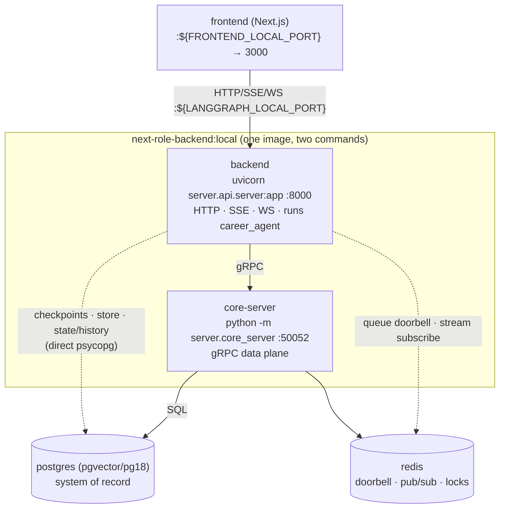

# Backend Architecture — the NextRole Agent Server

NextRole's backend ships its **own self-hosted agent server**: an ASGI application that
implements the LangGraph Server API (assistants, threads, runs, store, crons, MCP, A2A, and
the v2 event-streaming protocol spoken by `@langchain/langgraph-sdk` clients) and executes
the agents in-process. This document explains what lives where, how the pieces talk to each
other, and what to know before touching any of it.

## Table of contents

1. [TL;DR & topology](#1-tldr--topology)
2. [Package layout](#2-package-layout)
3. [The two-plane design](#3-the-two-plane-design)
4. [The run queue](#4-the-run-queue)
5. [Streaming](#5-streaming)
6. [Schema & migrations](#6-schema--migrations)
7. [Configuration knobs](#7-configuration-knobs)
8. [Known limitations](#8-known-limitations)
9. [Production sketch](#9-production-sketch)
10. [Maintenance: generated code, pins & tests](#10-maintenance-generated-code-pins--tests)

---

## 1. TL;DR & topology

One image (`backend/Dockerfile`, `python:3.13-slim` + uv), two compose services:

- **`backend`** — `uvicorn server.api.server:app` on container **:8000** (host
  `${LANGGRAPH_LOCAL_PORT}`). HTTP + SSE + WebSocket API, auth (noop locally), validation,
  **and graph execution**: an embedded worker pool (`N_JOBS_PER_WORKER`, default 10) claims
  queued runs and executes `career_agent` in-process. Stateless.
- **`core-server`** — `python -m server.core_server`, gRPC on **:50052** (internal only, no host
  port). The **data plane**: owner of all `assistant` / `thread` / `run` / `cron` SQL, the
  atomic run-queue claim, and the Redis pub/sub fan-out. The backend refuses to finish boot
  until this is reachable (`server/runtime_postgres/lifespan.py` gathers
  `wait_until_grpc_ready()`).
- **`postgres`** (pgvector/pg18) — durable system of record: assistants, threads, runs,
  checkpoints, the KV `store` (DeepAgents' StoreBackend), crons.
- **`redis`** — queue doorbell, streaming bus, control signals, caches/locks. Holds **no
  durable truth**: wiping it loses in-flight streams, never data.

The frontend talks to the backend **directly** (no Next.js proxy):
`@langchain/langgraph-sdk` `Client` for REST, `@langchain/react` `useStream` for v2 streaming.

**Hot reload:** the `backend` service runs uvicorn `--reload` over the bind-mounted source, so
edits under `backend/` (agents and server packages alike) restart the server.
**`core-server` does not hot-reload** — after editing `backend/server/core_server/` or
`backend/server/grpc_common/`, run `docker compose restart core-server`.

## 2. Package layout

| Package | LOC (approx) | Role |
|---|---|---|
| `server/api/` | 36k | The ASGI server: routes (assistants/threads/runs/store/crons/mcp/a2a), auth, streaming, graph loading, worker, gRPC client |
| `server/runtime/` | 85 | Edition router — `__init__.py` reads `LANGGRAPH_RUNTIME_EDITION` and aliases `runtime.*` submodules to the chosen backend in `sys.modules` (`postgres` → local `runtime_postgres`; `inmem` → the PyPI `langgraph-runtime-inmem` package) |
| `server/runtime_postgres/` | 3.5k | Postgres backend: pool + migrations, checkpoint ingestion, queue loop, store, lifespan |
| `server/grpc_common/` | 5.6k | Generated protobuf/gRPC stubs (`proto/`, **do not edit or lint** — see §10) + proto↔python conversion |
| `server/core_server/` | 2.5k | The gRPC data plane; imports only `grpc_common` |

Plus `storage/migrations/` (60 versioned SQL migrations + 2 `.lite` variants) at the backend
root, and — inside `server/` — `logging.json` (uvicorn log config; references
`server.api.logging.Formatter`) and `openapi.json`, which is **read at import time** from the
directory containing `api/`, i.e. `backend/server/`
(`server/api/validation.py`, `Path(__file__).parent.parent / "openapi.json"`). Moving either
the package or the file breaks server startup.

Naming: everything platform-side lives under the single `server` package (`server.api`,
`server.runtime`, …), keeping the backend root two-concept — `agents/` (the product) and
`server/` (the platform) — and giving every tooling scope one prefix. These are application
packages resolved via `PYTHONPATH=/deps/next-role/backend`, never published to PyPI.
Environment variables keep their `LANGGRAPH_*` / `LANGSERVE_*` names for compatibility with
the LangGraph SDK ecosystem.

The server carries **no license machinery** — NextRole is open source; `server/api/metadata.py` pins
`PLAN = "enterprise"` so every feature tier is always on.

## 3. The two-plane design

Everything pivots on `server/api/feature_flags.py`: `LANGGRAPH_RUNTIME_EDITION=postgres`
makes `IS_POSTGRES_OR_GRPC_BACKEND` true, and every HTTP handler then imports its ops layer
from `server.api.grpc.ops` (thin gRPC clients) instead of in-process ops. core-server is
the only component issuing SQL against the metadata tables.

The split is deliberately **partial** — two data classes bypass gRPC and hit Postgres
directly from the backend process (`server/runtime_postgres/database.py`,
`connect(supports_core_api=...)`):

1. **Checkpoints** (graph state snapshots) — written on the hot path of every superstep;
   the extra gRPC hop would double serialization on the highest-volume writes.
2. **The KV store** (`/store/*`, DeepAgents memory) and **thread state/history reads**.

Why a separate data plane at all: bounded Postgres connections (N backend replicas share a
few core-server pools instead of N pools), and one owner for correctness-critical logic —
the atomic `FOR NO KEY UPDATE SKIP LOCKED` run claim, assistant versioning, joint
run+thread status transitions.

## 4. The run queue

**"Queue of record in Postgres, doorbell in Redis."** A run is a row in `run` with
`status='pending'` — created in the same transaction that flips the thread to `busy`.
Workers never poll in a tight loop:

1. The backend's queue loop (`server/runtime_postgres/queue.py`) waits for a free
   concurrency slot, then calls `Runs.Next(wait=True, limit=free_slots)` over gRPC.
2. core-server tries an immediate claim: `UPDATE run SET status='running' ... WHERE status =
   'pending' ... FOR NO KEY UPDATE SKIP LOCKED` against a **partial index of pending rows
   only** — an index-only scan of a nearly-empty index.
3. Nothing pending → it parks on `BLPOP run:queue` (Redis) for up to 5 s. `Runs.Create`
   rings the doorbell with `LPUSH` — one parked worker wakes instantly.

Durability comes from Postgres (a `pending` row survives any crash), fairness and
exactly-one-claimer from `SKIP LOCKED`, latency from the Redis doorbell. Losing Redis
degrades queue latency to the 5 s timeout; no runs are lost.

Retries: a retriable failure re-pends the run; attempts count in Redis
(`BG_JOB_MAX_RETRIES`, default 3). Per-run wall clock: `BG_JOB_TIMEOUT_SECS` (default 24 h).
Graceful drain on SIGTERM: `BG_JOB_SHUTDOWN_GRACE_PERIOD_SECS` (default 180).

## 5. Streaming

The process that produces tokens (a worker that claimed the run) is not necessarily the
process holding the client's connection — so events rendezvous through Redis pub/sub on
per-run channels (`thread:{tid}:run:{rid}:stream`), fronted by core-server:

worker → gRPC `Runs.Publish` → core-server → Redis `PUBLISH` → core-server (subscriber
stream) → backend → SSE/WebSocket to the browser.

The frontend uses the **v2 event-streaming protocol** (`@langchain/react` `useStream`):
`POST|WebSocket /threads/{thread_id}/stream/events` + `POST /threads/{thread_id}/commands`,
mounted in `server/api/api/event_streaming.py` behind `FF_V2_EVENT_STREAMING` (default
`"true"`). The wire format is `langchain-protocol` (pinned `>=0.0.18` to match the frontend
SDK's bundled version — it is pre-1.0; keep the two in lockstep). Cancellation travels the
same bus on a `:control` channel with a 60 s `SET` to cover the subscribe race.

Meta endpoints: `/ok` (LB health; also pings core-server gRPC health), `/info` (version +
flags), `/metrics` (Prometheus), `/docs` + `/openapi.json`, plus `/mcp` and
`/a2a/{assistant_id}`.

## 6. Schema & migrations

12 tables; the important ones: `assistant`(+`assistant_versions`), `thread` (latest
materialized `values` for fast reads), `run` (**also the queue**), `checkpoints` /
`checkpoint_blobs` / `checkpoint_writes` (state snapshots with `parent_checkpoint_id`
lineage → time travel), `store` (cross-thread KV — DeepAgents memory), `cron`,
`thread_ttl`, `checkpoint_delete_queue`, `schema_migrations`.

**Migrations are owned by this repo** (`backend/storage/migrations/`, versions 000001–000060)
and applied by the **backend at boot** under a Redis lock
(`server/runtime_postgres/database.py` — `CREATE TABLE IF NOT EXISTS schema_migrations`,
skip every `version <= MAX(version)`, apply the rest, one row per version). A database that
is already at or beyond the shipped max is a clean no-op, so restarts and rolling deploys
are safe. core-server never migrates; it assumes the schema.

The `.lite` variants of 000017/000029 apply when `LANGGRAPH_POSTGRES_EXTENSIONS=lite`
(default `standard`). `backend/init.sql` only enables the pgvector extension on first
volume creation.

Most foreign keys are deliberately dropped by the later migrations (write-path lock
avoidance, independent GC); referential integrity is app-enforced by core-server.

## 7. Configuration knobs

All read in `server/api/config/__init__.py` unless noted. The compose file sets the starred ones.

| Env var | Default | Meaning |
|---|---|---|
| `LANGGRAPH_RUNTIME_EDITION` ★ | — (**required**; router raises) | `postgres` selects the gRPC-backed runtime (`server/runtime/__init__.py`) |
| `DATABASE_URI` / `POSTGRES_URI` ★ | — (**required**) | `DATABASE_URI` wins, falls back to `POSTGRES_URI`; plain `postgresql://` DSN |
| `REDIS_URI` ★ | — (**required at import**) | importing `server.api.config` fails without it (also true for pytest importing server modules) |
| `LSD_GRPC_SERVER_ADDRESS` ★ | `localhost:50052` | where the backend dials core-server |
| `MIGRATIONS_PATH` ★ | `/storage/migrations` | must point at `backend/storage/migrations` |
| `LANGSERVE_GRAPHS` ★ | — | JSON `{graph_id: "path.py:variable"}`; any source containing `/` is loaded as a file path (`server/api/graph.py`) |
| `N_JOBS_PER_WORKER` | `10` | embedded worker concurrency; `0` = web-only, no queue |
| `FF_CRONS_ENABLED` | `true` | cron scheduler in this process (keep exactly one) |
| `FF_V2_EVENT_STREAMING` | `true` | v2 `/stream/events` + `/commands` routes |
| `CORS_ALLOW_ORIGINS` | `*` | fine for local dev; tighten for any shared deployment |
| `LANGGRAPH_AUTH_TYPE` | `noop` | custom auth backends live in `server/api/auth/` |
| `CORE_SERVER_BIND` ★ | `0.0.0.0:50052` | core-server listen address (`server/core_server/settings.py`) |
| `CORE_SERVER_GO_FALLBACK` ★ | `localhost:50051` | **must be `""`** — non-empty forwards unimplemented RPCs to an external gRPC server that doesn't exist here |
| `CORE_SERVER_POSTGRES_URI` / `CORE_SERVER_REDIS_URI` ★ | derived | core-server's own connections |
| `BG_JOB_MAX_RETRIES` / `BG_JOB_TIMEOUT_SECS` / `BG_JOB_SHUTDOWN_GRACE_PERIOD_SECS` | 3 / 86400 / 180 | run retry/timeout/drain budget |

## 8. Known limitations

Real properties of this codebase — accepted for a single-user local deployment, listed so
nobody is surprised later:

1. **No resumable streams / event replay.** Streaming is live pub/sub only; a late joiner
   or `Last-Event-ID` reconnect is not back-filled (final state still recoverable from the
   DB).
2. **No orphan-run sweeper.** A hard-killed worker (OOM/SIGKILL) leaves its run stuck in
   `status='running'` forever; core-server's `Sweep` RPC is a no-op. Mitigation if it ever
   matters: periodically re-pend runs `running` longer than a threshold.
3. **Cron scheduling is not multi-scheduler safe** (`Crons.Next` has no `SKIP LOCKED`) —
   run exactly one process with `FF_CRONS_ENABLED=true`. Locally that's the single
   `backend` service.
4. **Referential integrity is app-enforced** (FKs dropped by design); a data-plane bug can
   orphan rows silently.
5. **The backend is not Postgres-free** — checkpoints/store/state bypass gRPC, so backend
   replicas also consume DB connections (matters only when scaling out, §9).

## 9. Production sketch

Locally, one `backend` container fuses web + workers + cron. To scale (same image, different
commands/env):

- **api-web** — uvicorn, `N_JOBS_PER_WORKER=0`, `FF_CRONS_ENABLED=false`; scale on
  connections/CPU.
- **api-worker** — `python -m server.api.queue_entrypoint`, `N_JOBS_PER_WORKER=K`;
  scale on pending-run backlog (runs are LLM-I/O-bound — push K up before adding pods).
- **cron** — one replica.
- **core-server** — 2–3 replicas behind a headless service with client-side gRPC LB; its
  ceiling is Postgres connections, not RPS. Put PgBouncer (transaction mode) in front of
  Postgres and budget: `core_replicas×pool + worker_replicas×ckpt_pool + web_replicas×state_pool`.
- Set worker `terminationGracePeriodSeconds ≥ BG_JOB_SHUTDOWN_GRACE_PERIOD_SECS`.

Serverless containers (Cloud Run / Fargate / Container Apps) fit this workload with no code
changes; FaaS does not (long runs, persistent gRPC, SSE).

## 10. Maintenance: generated code, pins & tests

- **Generated code:** `server/grpc_common/proto/` is protoc/grpcio-tools output — never hand-edit,
  lint, or format it. It is excluded three ways: `[tool.ruff] exclude` (top-level — a
  `[tool.ruff.lint]` exclude would silently not cover `ruff format`), the pre-commit ruff
  hooks' `exclude:` regex (pre-commit passes filenames explicitly, which bypasses ruff's own
  exclude), and `.gitattributes` `linguist-generated`. Regenerate only with
  `grpcio-tools==1.80.0` (dev group) — the runtime `grpcio>=1.80,<1.81` band must match the
  `GRPC_GENERATED_VERSION` baked into the stubs. The stubs import `google.protobuf`
  well-known types purely for their descriptor-pool registration side effects; stripping
  "unused" imports there breaks every server import.
- **Dependency ceilings are compat pins, not staleness:** `grpcio<1.81` (stubs),
  `protobuf<7`, `sse-starlette<3.4`, `jsonschema-rs<0.45`, `structlog<26`, `langgraph<2`,
  `langchain-protocol<0.1` (wire format shared with the frontend SDK — bump both sides
  together).
- **Quality gates:** the server packages run under a scoped `per-file-ignores` entry in
  `backend/pyproject.toml` (noisy stylistic families off; `F`/`E`/`W`/`B`/`I`/`DTZ`/`RUF`
  stay on and are clean) and are excluded from `ty` (`[tool.ty.src]`). `agents/` and
  `tests/` keep the full strict bar. **One-time `S` (security) review:** 46 findings, all
  by-design — S608 SQL built from trusted internal templates (the data plane owns its
  schema), S104 servers binding 0.0.0.0 inside containers, S311 `random` for retry jitter,
  S110/S112 best-effort cleanup paths. Nothing user-input-reachable.
- **Tests:** the server packages carry no mirrored unit tests (see `backend/CLAUDE.md`) —
  importing server modules requires env scaffolding (`REDIS_URI` at import), and the
  correctness bar is the e2e contract: `backend/tests/server/test_smoke.py`
  (integration-marked) plus the frontend round-trip.
