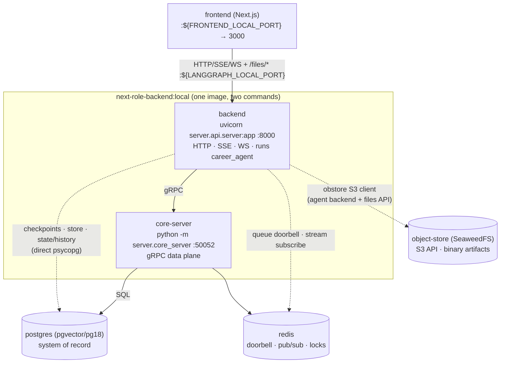

# Backend Architecture — the NextRole Agent Server

NextRole's backend ships its **own self-hosted agent server**: an ASGI application that
implements the LangGraph Server API (assistants, threads, runs, store, crons, MCP, A2A, and
the v2 event-streaming protocol spoken by `@langchain/langgraph-sdk` clients) and executes
the agents in-process. This document explains what lives where, how the pieces talk to each
other, and what to know before touching any of it.

## Table of contents

1. [TL;DR & topology](#1-tldr--topology)
2. [Package layout](#2-package-layout)
3. [The two-plane design](#3-the-two-plane-design)
4. [The run queue](#4-the-run-queue)
5. [Streaming](#5-streaming)
6. [Schema & migrations](#6-schema--migrations)
7. [Configuration knobs](#7-configuration-knobs)
8. [Authentication & multi-user](#8-authentication--multi-user)
9. [Known limitations](#9-known-limitations)
10. [Production sketch](#10-production-sketch)
11. [Maintenance: generated code, pins & tests](#11-maintenance-generated-code-pins--tests)

---

## 1. TL;DR & topology

One image (`backend/Dockerfile`, `python:3.13-slim` + uv), two compose services:

- **`backend`** — `uvicorn server.api.server:app` on container **:8000** (host
  `${LANGGRAPH_LOCAL_PORT}`). HTTP + SSE + WebSocket API, auth (noop by default; custom
  JWT auth when `LANGGRAPH_AUTH` is set — see §8), validation,
  **and graph execution**: an embedded worker pool (`N_JOBS_PER_WORKER`, default 10) claims
  queued runs and executes `career_agent` in-process. Stateless.
- **`core-server`** — `python -m server.core_server`, gRPC on **:50052** (internal only, no host
  port). The **data plane**: owner of all `assistant` / `thread` / `run` / `cron` SQL, the
  atomic run-queue claim, and the Redis pub/sub fan-out. The backend refuses to finish boot
  until this is reachable (`server/runtime_postgres/lifespan.py` gathers
  `wait_until_grpc_ready()`).
- **`postgres`** (pgvector/pg18) — durable system of record: assistants, threads, runs,
  checkpoints, the KV `store` (DeepAgents' StoreBackend), crons.
- **`redis`** — queue doorbell, streaming bus, control signals, caches/locks. Holds **no
  durable truth**: wiping it loses in-flight streams, never data.
- **`object-store`** (SeaweedFS, S3 API on :8333 / host `${OBJECT_STORE_LOCAL_PORT}`) — binary
  artifacts (uploads + rendered PDFs) under deterministic keys
  (`users/default/career_agent/<area>/<relpath>`). The backend serves them over HTTP via a
  small **files API** (`backend/agents/files_api.py`) mounted through the server's
  `LANGGRAPH_HTTP` custom-app hook — no edits inside `server/`. In the cloud, swap the
  endpoint for S3 / GCS / Azure via `OBJECT_STORE_*` env (`obstore` client).



The frontend talks to the backend **directly** (no Next.js proxy):
`@langchain/langgraph-sdk` `Client` for REST, `@langchain/react` `useStream` for v2 streaming.

**Hot reload:** the `backend` service runs uvicorn `--reload` over the bind-mounted source, so
edits under `backend/` (agents and server packages alike) restart the server.
**`core-server` does not hot-reload** — after editing `backend/server/core_server/` or
`backend/server/grpc_common/`, run `docker compose restart core-server`.

## 2. Package layout

| Package | LOC (approx) | Role |
|---|---|---|
| `server/api/` | 36k | The ASGI server: routes (assistants/threads/runs/store/crons/mcp/a2a), auth, streaming, graph loading, worker, gRPC client |
| `server/runtime/` | 85 | Edition router — `__init__.py` reads `LANGGRAPH_RUNTIME_EDITION` and aliases `runtime.*` submodules to the chosen backend in `sys.modules` (`postgres` → local `runtime_postgres`; `inmem` → the PyPI `langgraph-runtime-inmem` package) |
| `server/runtime_postgres/` | 3.5k | Postgres backend: pool + migrations, checkpoint ingestion, queue loop, store, lifespan |
| `server/grpc_common/` | 5.6k | Generated protobuf/gRPC stubs (`proto/`, **do not edit or lint** — see §11) + proto↔python conversion |
| `server/core_server/` | 2.5k | The gRPC data plane; imports only `grpc_common` |

Plus `storage/migrations/` (a single consolidated schema migration, `000001_init.up.sql`;
future changes go in new files numbered `000002+`) at the backend root, and — inside `server/` — `logging.json` (uvicorn log config; references
`server.api.logging.Formatter`) and `openapi.json`, which is **read at import time** from the
directory containing `api/`, i.e. `backend/server/`
(`server/api/validation.py`, `Path(__file__).parent.parent / "openapi.json"`). Moving either
the package or the file breaks server startup.

Naming: everything platform-side lives under the single `server` package (`server.api`,
`server.runtime`, …), keeping the backend root two-concept — `agents/` (the product) and
`server/` (the platform) — and giving every tooling scope one prefix. These are application
packages resolved via `PYTHONPATH=/deps/next-role/backend`, never published to PyPI.
Environment variables keep their `LANGGRAPH_*` / `LANGSERVE_*` names for compatibility with
the LangGraph SDK ecosystem.

The server carries **no license machinery** — NextRole is open source; `server/api/metadata.py` pins
`PLAN = "enterprise"` so every feature tier is always on.

## 3. The two-plane design

Everything pivots on `server/api/feature_flags.py`: `LANGGRAPH_RUNTIME_EDITION=postgres`
makes `IS_POSTGRES_OR_GRPC_BACKEND` true, and every HTTP handler then imports its ops layer
from `server.api.grpc.ops` (thin gRPC clients) instead of in-process ops. core-server is
the only component issuing SQL against the metadata tables.

The split is deliberately **partial** — two data classes bypass gRPC and hit Postgres
directly from the backend process (`server/runtime_postgres/database.py`,
`connect(supports_core_api=...)`):

1. **Checkpoints** (graph state snapshots) — written on the hot path of every superstep;
   the extra gRPC hop would double serialization on the highest-volume writes.
2. **The KV store** (`/store/*`, DeepAgents memory) and **thread state/history reads**.

Auth note: because core-server is the sole owner of the metadata-table SQL, it is also
where per-user authorization is *enforced* (translating the auth handlers' filters into SQL
WHERE clauses — §8). The backend-side ops layer only *computes* those filters. The KV store
and thread state/history bypass, though, means their isolation is not a servicer filter but a
namespace/ownership property the store handler and the `Threads.get` gate provide (§8).

Why a separate data plane at all: bounded Postgres connections (N backend replicas share a
few core-server pools instead of N pools), and one owner for correctness-critical logic —
the atomic `FOR NO KEY UPDATE SKIP LOCKED` run claim, assistant versioning, joint
run+thread status transitions.

## 4. The run queue

**"Queue of record in Postgres, doorbell in Redis."** A run is a row in `run` with
`status='pending'` — created in the same transaction that flips the thread to `busy`.
Workers never poll in a tight loop:

1. The backend's queue loop (`server/runtime_postgres/queue.py`) waits for a free
   concurrency slot, then calls `Runs.Next(wait=True, limit=free_slots)` over gRPC.
2. core-server tries an immediate claim: `UPDATE run SET status='running' ... WHERE status =
   'pending' ... FOR NO KEY UPDATE SKIP LOCKED` against a **partial index of pending rows
   only** — an index-only scan of a nearly-empty index.
3. Nothing pending → it parks on `BLPOP run:queue` (Redis) for up to 5 s. `Runs.Create`
   rings the doorbell with `LPUSH` — one parked worker wakes instantly.

Durability comes from Postgres (a `pending` row survives any crash), fairness and
exactly-one-claimer from `SKIP LOCKED`, latency from the Redis doorbell. Losing Redis
degrades queue latency to the 5 s timeout; no runs are lost.

Retries: a retriable failure re-pends the run; attempts count in Redis
(`BG_JOB_MAX_RETRIES`, default 3). Per-run wall clock: `BG_JOB_TIMEOUT_SECS` (default 24 h).
Graceful drain on SIGTERM: `BG_JOB_SHUTDOWN_GRACE_PERIOD_SECS` (default 180).

## 5. Streaming

The process that produces tokens (a worker that claimed the run) is not necessarily the
process holding the client's connection — so events rendezvous through Redis pub/sub on
per-run channels (`thread:{tid}:run:{rid}:stream`), fronted by core-server:

worker → gRPC `Runs.Publish` → core-server → Redis `PUBLISH` → core-server (subscriber
stream) → backend → SSE/WebSocket to the browser.

The frontend uses the **v2 event-streaming protocol** (`@langchain/react` `useStream`):
`POST|WebSocket /threads/{thread_id}/stream/events` + `POST /threads/{thread_id}/commands`,
mounted in `server/api/api/event_streaming.py` behind `FF_V2_EVENT_STREAMING` (default
`"true"`). The wire format is `langchain-protocol` (pinned `>=0.0.18` to match the frontend
SDK's bundled version — it is pre-1.0; keep the two in lockstep). Cancellation travels the
same bus on a `:control` channel with a 60 s `SET` to cover the subscribe race.

Alongside the live channels, core-server keeps a **per-thread durable event log** (Redis
Stream `thread:{tid}:events`, written by `Runs.Publish`/`MarkDone`). `Threads.Stream`
serves subscribers in two phases: replay the structural log from `last_event_id`, then
tail the live pub/sub channels — which carry everything, including the chunked message
events that drive token-by-token text and tool-argument streaming (chunks must NOT be
served from the log; an XREAD-only version silently reduced live streaming to structural
events). Published structural events carry their log entry id (`stream_id`), so the
replay→live seam dedups exactly by monotonic id comparison; the id doubles as the wire
`event_id` for client-side dedup.
This is what the SDK's contract requires — it **rotates** its shared SSE whenever a
subagent pane mounts mid-run and expects the fresh stream to replay history — and it is
also what hydrates subagent activity when reopening a historical thread. The log stores
**structural events only** (`tools`, `values`, `lifecycle`, `control`): chunked message
streams are live-only, because measured on a real multi-subagent run they were ~99% of
entries and 95% of 66 MB, flooding the cap until the earliest subagents' tool events were
trimmed. Bounds: ~8192 entries (approximate trim) and a 7-day TTL
(`server/core_server/redis_db.py`) — beyond them, history panes degrade to the
input/output summary held in thread state.

Meta endpoints: `/ok` (LB health; also pings core-server gRPC health), `/info` (version +
flags), `/metrics` (Prometheus), `/docs` + `/openapi.json`, plus `/mcp` and
`/a2a/{assistant_id}`.

## 6. Schema & migrations

12 tables; the important ones: `assistant`(+`assistant_versions`), `thread` (latest
materialized `values` for fast reads), `run` (**also the queue**), `checkpoints` /
`checkpoint_blobs` / `checkpoint_writes` (state snapshots with `parent_checkpoint_id`
lineage → time travel), `store` (cross-thread KV — DeepAgents memory), `cron`,
`thread_ttl`, `checkpoint_delete_queue`, `schema_migrations`.

**Migrations are owned by this repo** (`backend/storage/migrations/`) and applied by the
**backend at boot** under a Redis lock (`server/runtime_postgres/database.py` —
`CREATE TABLE IF NOT EXISTS schema_migrations`, skip every `version <= MAX(version)`, apply
the rest, one `schema_migrations` row per version). A database already at or beyond the
shipped max is a clean no-op, so restarts and rolling deploys are safe. core-server never
migrates; it assumes the schema.

The whole schema ships as **one consolidated migration** (`000001_init.up.sql` — extensions,
all 12 tables, every index/constraint, verified equivalent to the schema the incremental
history produced). Add future changes as new files numbered `000002+`; never edit 000001
after it has been applied anywhere. `backend/init.sql` only enables the pgvector extension
on first volume creation (the migration also creates it defensively).

Most foreign keys are deliberately dropped by the later migrations (write-path lock
avoidance, independent GC); referential integrity is app-enforced by core-server.

## 7. Configuration knobs

All read in `server/api/config/__init__.py` unless noted. The compose file sets the starred ones.

| Env var | Default | Meaning |
|---|---|---|
| `LANGGRAPH_RUNTIME_EDITION` ★ | — (**required**; router raises) | `postgres` selects the gRPC-backed runtime (`server/runtime/__init__.py`) |
| `DATABASE_URI` / `POSTGRES_URI` ★ | — (**required**) | `DATABASE_URI` wins, falls back to `POSTGRES_URI`; plain `postgresql://` DSN |
| `REDIS_URI` ★ | — (**required at import**) | importing `server.api.config` fails without it (also true for pytest importing server modules) |
| `LSD_GRPC_SERVER_ADDRESS` ★ | `localhost:50052` | where the backend dials core-server |
| `MIGRATIONS_PATH` ★ | `/storage/migrations` | must point at `backend/storage/migrations` |
| `LANGSERVE_GRAPHS` ★ | — | JSON `{graph_id: "path.py:variable"}`; any source containing `/` is loaded as a file path (`server/api/graph.py`) |
| `LANGGRAPH_HTTP` ★ | — | JSON `{"app": "path.py:app"}` — mounts a user Starlette/FastAPI app into the server (`load_custom_app`). Used for the artifact **files API** (`backend/agents/files_api.py`); add `"enable_custom_route_auth": true` (compose does) to put its routes behind the server's auth middleware in multi-user mode |
| `OBJECT_STORE_*` ★ | — | S3-compatible artifact storage: endpoint/bucket/region/creds/path-style. Local = SeaweedFS; cloud = S3 / GCS / Azure. Deliberately separate from `AWS_*` (Bedrock creds) |
| `N_JOBS_PER_WORKER` | `10` | embedded worker concurrency; `0` = web-only, no queue |
| `FF_CRONS_ENABLED` | `true` | cron scheduler in this process (keep exactly one) |
| `FF_V2_EVENT_STREAMING` | `true` | v2 `/stream/events` + `/commands` routes |
| `CORS_ALLOW_ORIGINS` | `*` | fine for local dev; **pin to the frontend origin** for any shared deployment |
| `LANGGRAPH_AUTH_TYPE` | `noop` | `noop` = unauthenticated single-user; custom auth backends live in `server/api/auth/`. See §8 |
| `LANGGRAPH_AUTH` | — | JSON `{"path": "…/agents/auth.py:auth", "disable_studio_auth": true}` — activates custom JWT auth + per-user authorization (§8). Unset = single-user |
| `REQUIRE_AUTH` | `false` | boot guard: `true` + no `LANGGRAPH_AUTH` → the server refuses to start (cloud safety net) |
| `AUTH_JWKS_URL` | — | JWKS endpoint the `@auth.authenticate` handler verifies bearer JWTs against (the frontend's `/api/auth/jwks`). Required when `LANGGRAPH_AUTH` is set |
| `AUTH_JWT_ISSUER` / `AUTH_JWT_AUDIENCE` | — | expected `iss` / `aud` claims (the frontend origin); checked when present |
| `CORE_SERVER_BIND` ★ | `0.0.0.0:50052` | core-server listen address (`server/core_server/settings.py`) |
| `CORE_SERVER_GO_FALLBACK` ★ | `localhost:50051` | **must be `""`** — non-empty forwards unimplemented RPCs to an external gRPC server that doesn't exist here |
| `CORE_SERVER_POSTGRES_URI` / `CORE_SERVER_REDIS_URI` ★ | derived | core-server's own connections |
| `BG_JOB_MAX_RETRIES` / `BG_JOB_TIMEOUT_SECS` / `BG_JOB_SHUTDOWN_GRACE_PERIOD_SECS` | 3 / 86400 / 180 | run retry/timeout/drain budget |

## 8. Authentication & multi-user

The server ships the **complete LangGraph custom-auth framework** (`server/api/auth/`) but runs
it as **noop by default** — a single unauthenticated user, every resource shared. Setting
`LANGGRAPH_AUTH` flips the whole platform into per-user mode; unsetting it returns to exactly
the single-user behavior (every enforcement clause below collapses to empty). This dual mode is
a hard invariant: the local `docker compose up` experience must stay zero-login and byte-for-byte
unchanged.

**Enable it** (see [`.env.example`](../.env.example) for the full runbook): stand up the
frontend's [Better Auth](https://better-auth.com) (Google + email/password, JWT plugin), set
`LANGGRAPH_AUTH={"path": "…/agents/auth.py:auth", "disable_studio_auth": true}` plus
`AUTH_JWKS_URL` / `AUTH_JWT_ISSUER` / `AUTH_JWT_AUDIENCE`, add
`"enable_custom_route_auth": true` to `LANGGRAPH_HTTP`, pin `CORS_ALLOW_ORIGINS`, and in the
cloud set `REQUIRE_AUTH=true`.

### Request flow

```
browser ──session cookie──▶ frontend (Better Auth: mints short-lived EdDSA JWT, sub = user id)
   └──Authorization: Bearer <JWT>──▶ backend
        @auth.authenticate (agents/auth.py): verify JWT vs JWKS → identity
        AuthenticationMiddleware sets scope["user"]; ApiRoute enters the AuthContext ContextVar
        @auth.on.* handlers: stamp metadata.owner, return {"owner": id} filters, rewrite store ns
        merge_auth injects langgraph_auth_user into the run's configurable
        ops layer → gRPC → core-server servicers: translate filters → SQL WHERE (enforcement)
        worker restores langgraph_auth_user for the run → agent backends scope storage by identity
```

### Two halves: identity + authorization

1. **Authentication & authorization handlers** live in the *product* tree,
   `backend/agents/auth.py` (`auth = Auth()`), not in `server/`:
   - `@auth.authenticate` reads the `Authorization` bearer (works on HTTP **and** WebSocket
     scopes because it takes `authorization`, not `request`), verifies it against the JWKS with
     the algorithm **pinned to EdDSA** (never trusting the token header) and `iss`/`aud` checked,
     and returns the identity (`sub`).
   - `@auth.on.threads` / `.crons` stamp `metadata.owner = identity` on writes and return an
     `{"owner": identity}` filter; `@auth.on.assistants` allows reads for all and denies writes
     (assistants are shared system config); `@auth.on.store` rewrites each namespace so its first
     segment is the identity; a global default-deny `@auth.on` fails closed.

2. **Enforcement** happens in core-server. Upstream, the ops layer *computes* auth filters and
   ships them on request protos, but the native servicers historically **ignored them** — so the
   filters were a no-op. `server/core_server/_filters.py` closes that: it translates the
   `AuthFilter` protos (`$eq` / `$contains` / `$and` / `$or`) into **parameterized** JSONB
   predicates (values always bound via `Jsonb`, never interpolated; the `owner` equality hits the
   `thread_owner_updated_idx` partial index), wired into every read/write of
   `threads` / `runs` / `crons` / `assistants`. Ownership is invisible-not-forbidden:
   a resource the caller doesn't own returns **`NOT_FOUND`**, never a 403 existence oracle. Two
   non-obvious sites carry the highest blast radius:
   - **`ThreadsServicerImpl.Stream`** gates ownership *before* subscribing to the pub/sub
     channels — without it any authenticated caller could stream another user's live,
     token-by-token events by thread id (both the v1 `/stream` and the v2 `/stream/events`
     transport reach this method).
   - **`RunsServicerImpl.Create`** enforces `thread_filters` / `assistant_filters`, blocking a
     run injected into a thread the caller doesn't own.

### Per-user storage scoping

The two persistence tiers scope at **call time** (the agent backends are import-time singletons,
so identity comes from the run config, not construction), via
`backend/agents/career_agent/scope.py`:

- **KV store** (Postgres, DeepAgents `StoreBackend`): namespaces become
  `(<identity>, "career_agent", <area>)` when authenticated, and stay the original
  `("career_agent", <area>)` 2-tuple otherwise — no user segment appears in single-user mode, so
  pre-existing rows are untouched. Per-user memory (`/memory/preferences.md`) falls out for free.
- **Object store**: keys become `users/<identity>/career_agent/<area>/…` (or
  `users/default/…` single-user, matching the historical layout). The agent backend resolves
  identity from the run runtime; the files API from `request.user.identity`.

The frontend needs no per-user store logic: it keeps sending logical `["career_agent", …]`
namespaces and the `@auth.on.store` rewrite prepends identity transparently, landing on the same
rows the agent writes.

### What stays outside the wall

- **Meta/health/docs routes** (`/`, `/info`, `/ok`, `/metrics`, `/docs`, `/openapi.json`) are
  unauthenticated by design — `/metrics` leaks thread/run counts, so block it at the ingress in a
  shared deployment.
- **MCP (`/mcp`) and A2A (`/a2a`)** are authentication-gated but have **no per-resource
  authorization** of their own yet — disable them (`disable_mcp` / `disable_a2a` in
  `LANGGRAPH_HTTP`) until that is audited.
- **Studio backdoors** are closed by `disable_studio_auth: true`; also never set
  `LANGSMITH_LANGGRAPH_API_VARIANT=local_dev` in production.
- Browsers can't set an `Authorization` header on a raw WebSocket handshake, so the frontend
  streams over the **SSE POST** transport (which carries the bearer); the WS route stays for
  non-browser clients.

## 9. Known limitations

Real properties of this codebase, listed so nobody is surprised later:

1. **Event replay is bounded, not archival.** The per-thread event log (§5) makes
   reconnects, SDK stream rotations, and history views lossless within its bounds
   (~8192 structural entries, 7-day TTL). Beyond them — or for chunked message streams,
   which are live-only — replay degrades gracefully: final state always rehydrates from
   Postgres, but per-tool subagent activity older than the log is gone. Truly durable
   pane history would have to be derived from the namespaced checkpoints.
2. **No orphan-run sweeper.** A hard-killed worker (OOM/SIGKILL) leaves its run stuck in
   `status='running'` forever; core-server's `Sweep` RPC is a no-op. Mitigation if it ever
   matters: periodically re-pend runs `running` longer than a threshold.
3. **Cron scheduling is not multi-scheduler safe** (`Crons.Next` has no `SKIP LOCKED`) —
   run exactly one process with `FF_CRONS_ENABLED=true`. Locally that's the single
   `backend` service.
4. **Referential integrity is app-enforced** (FKs dropped by design); a data-plane bug can
   orphan rows silently.
5. **The backend is not Postgres-free** — checkpoints/store/state bypass gRPC, so backend
   replicas also consume DB connections (matters only when scaling out, §10).
6. **Shell execution is not sandboxed for untrusted tenants.** Multi-user mode (§8) isolates
   *data*, but `VirtualPathShellBackend` still runs render commands via `subprocess` on the host.
   Fine for a single user or a trusted team; isolate render/shell steps (remote sandbox) before
   opening public signup.
7. **MCP / A2A carry no per-resource authorization** (§8) — only authentication. Disable them in
   a shared deployment until per-user scoping is wired into those handlers.

## 10. Production sketch

Locally, one `backend` container fuses web + workers + cron. To scale (same image, different
commands/env):

- **api-web** — uvicorn, `N_JOBS_PER_WORKER=0`, `FF_CRONS_ENABLED=false`; scale on
  connections/CPU.
- **api-worker** — `python -m server.api.queue_entrypoint`, `N_JOBS_PER_WORKER=K`;
  scale on pending-run backlog (runs are LLM-I/O-bound — push K up before adding pods).
- **cron** — one replica.
- **core-server** — 2–3 replicas behind a headless service with client-side gRPC LB; its
  ceiling is Postgres connections, not RPS. Put PgBouncer (transaction mode) in front of
  Postgres and budget: `core_replicas×pool + worker_replicas×ckpt_pool + web_replicas×state_pool`.
- Set worker `terminationGracePeriodSeconds ≥ BG_JOB_SHUTDOWN_GRACE_PERIOD_SECS`.

Serverless containers (Cloud Run / Fargate / Container Apps) fit this workload with no code
changes; FaaS does not (long runs, persistent gRPC, SSE). Binary artifacts already live behind
an S3-compatible client (`OBJECT_STORE_*`), so in the cloud the SeaweedFS service is replaced
by a managed bucket (S3 / GCS / Azure) — provision versioning/SSE/IAM there; no app changes.
Renders use a throwaway `TemporaryDirectory`, so worker pods need only ordinary ephemeral
`/tmp`.

For a multi-tenant deployment, additionally enable auth (§8) on **every** replica that serves
the API (`LANGGRAPH_AUTH` + `REQUIRE_AUTH=true` so a misconfigured pod refuses to boot rather
than serving everyone's data), pin `CORS_ALLOW_ORIGINS`, make the frontend's JWKS endpoint
reachable from the backend pods, terminate TLS at the ingress, and block the unauthenticated
meta routes (`/metrics`, `/docs`). The auth identity travels in the run's `configurable` and is
restored by the worker, so storage scoping (§8) holds on `api-worker` pods exactly as on
`api-web`.

## 11. Maintenance: generated code, pins & tests

- **Generated code:** `server/grpc_common/proto/` is protoc/grpcio-tools output — never hand-edit,
  lint, or format it. It is excluded three ways: `[tool.ruff] exclude` (top-level — a
  `[tool.ruff.lint]` exclude would silently not cover `ruff format`), the pre-commit ruff
  hooks' `exclude:` regex (pre-commit passes filenames explicitly, which bypasses ruff's own
  exclude), and `.gitattributes` `linguist-generated`. Regenerate only with
  `grpcio-tools==1.80.0` (dev group) — the runtime `grpcio>=1.80,<1.81` band must match the
  `GRPC_GENERATED_VERSION` baked into the stubs. The stubs import `google.protobuf`
  well-known types purely for their descriptor-pool registration side effects; stripping
  "unused" imports there breaks every server import.
- **Dependency ceilings are compat pins, not staleness:** `grpcio<1.81` (stubs),
  `protobuf<7`, `sse-starlette<3.4`, `jsonschema-rs<0.45`, `structlog<26`, `langgraph<2`,
  `langchain-protocol<0.1` (wire format shared with the frontend SDK — bump both sides
  together).
- **Quality gates:** the server packages run under a scoped `per-file-ignores` entry in
  `backend/pyproject.toml` (noisy stylistic families off; `F`/`E`/`W`/`B`/`I`/`DTZ`/`RUF`
  stay on and are clean) and are excluded from `ty` (`[tool.ty.src]`). `agents/` and
  `tests/` keep the full strict bar. **One-time `S` (security) review:** 46 findings, all
  by-design — S608 SQL built from trusted internal templates (the data plane owns its
  schema), S104 servers binding 0.0.0.0 inside containers, S311 `random` for retry jitter,
  S110/S112 best-effort cleanup paths. Nothing user-input-reachable.
- **Tests:** the server packages carry no mirrored unit tests (see `backend/CLAUDE.md`) —
  importing server modules requires env scaffolding (`REDIS_URI` at import), and the
  correctness bar is the e2e contract: `backend/tests/server/test_smoke.py`
  (integration-marked) plus the frontend round-trip.
