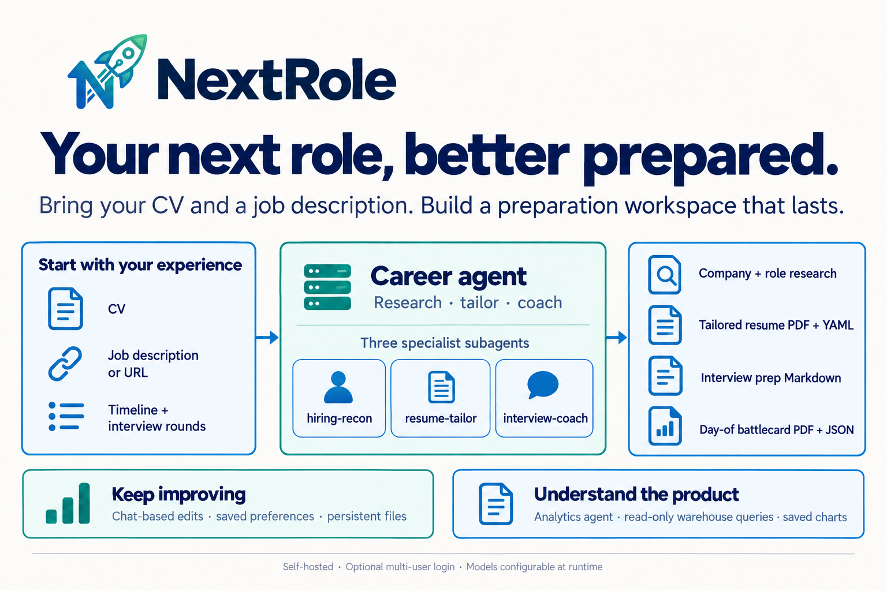

# NextRole Agents

NextRole provides two agents through its self-hosted agent server: a career agent for interview
preparation and an analytics agent for questions about product activity, reliability, and cost.

- **[Career agent](career_agent/README.md)** — coordinates research, resume tailoring, and interview
  coaching through three specialist subagents, then prepares a day-of battlecard. Follow-up edits
  go to the agent that owns the affected file.
- **[Analytics agent](analytics_agent/README.md)** — queries the warehouse with read-only access
  and saves charts and reports with the conversation.

See the [backend architecture](../ARCHITECTURE.md) for server execution, storage, and authentication,
or the [root README](../../README.md) for setup and the product walkthrough.
