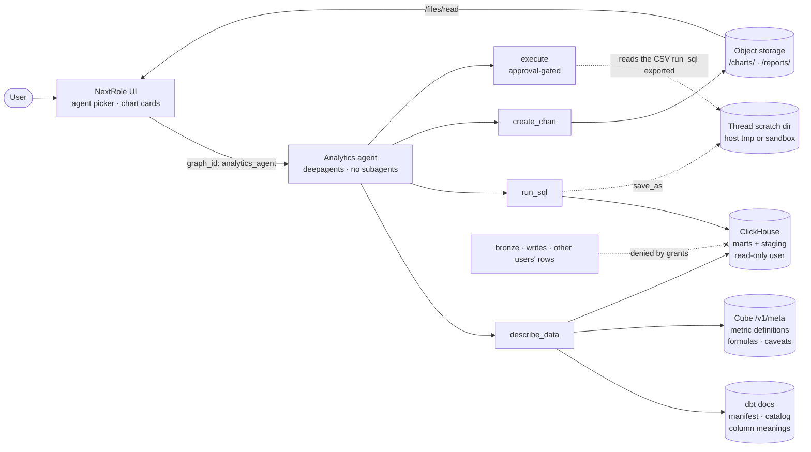
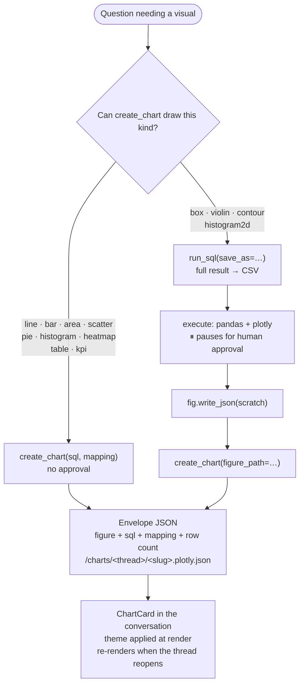

# Analytics agent

Answers questions about how NextRole is being used — activity, reliability, LLM cost, agent
behaviour — by querying the ClickHouse warehouse the analytics stack builds, and drawing the
result. A second graph beside the career agent, chosen from the UI's agent picker.

Registered as `analytics_agent` in both `LANGSERVE_GRAPHS` blocks in `docker-compose.yml`
(core-server enumerates graph ids; backend loads them).

## How it fits together



Three sources feed `describe_data` because none is complete on its own: dbt carries the prose
written for an agent, Cube carries how each metric is computed and when it misleads, and ClickHouse
carries types, row counts and sort keys. The read-only warehouse user is the security boundary —
the tool-side statement check is only there to turn obvious mistakes into readable text.

## How a chart gets made



Both paths end in the same stored artifact, which is why a chart survives the run that made it.
Figures carry no colours: the viewer's theme is applied at render time, so one chart reads correctly
in light and dark. `table` and `kpi` skip Plotly entirely and are drawn with the app's own
components. Scripts get no database credentials — data reaches them only through `save_as`.

## Layout

```
agents/analytics_agent/
├── agents.py              graph assembly (module-level `analytics_agent`)
├── ANALYTICS_AGENT.md     memory: layer map, marts, semantic caveats, dialect
├── prompts.py             system prompt + middleware prompt overrides
├── settings.py            per-concern BaseSettings (warehouse, Cube, dbt docs, access)
├── warehouse.py           read-only SQL: statement guard, limits, error hints
├── metadata.py            the merged data dictionary (dbt + Cube + ClickHouse)
├── charts.py              chart specs, Plotly figures, the stored envelope
├── scratch.py             per-thread scratch dir for the Python fallback
├── tools.py               describe_data · run_sql · create_chart
├── access.py              the admin allowlist
├── middleware.py          the gate that ends a run before the model sees it
└── skills/analytics-agent/
    ├── warehouse-analysis/
    │   ├── SKILL.md          discovery loop and query safety
    │   └── references/       ClickHouse dialect and question recipes
    └── charts/
        └── SKILL.md          chart selection, dashboards, the Python fallback
```

Shared plumbing is imported from `career_agent/` rather than duplicated: the model override and
UTC-date middleware, shell backend factory, execute-approval policy, object backend, scoping, and
object-key mapping. Only `career_agent/agents.py` builds a graph at import, and nothing here
imports it.

## Tools

**`describe_data(table=None, refresh=False)`** — the warehouse's own dictionary, merged from three
sources because no one of them is complete: dbt carries the prose written for this agent, Cube
carries the metric definitions and their caveats, and ClickHouse carries types, row counts and sort
keys. Cached ~10 minutes. A source being down degrades to a notice, not a failure.

**`run_sql(sql, save_as=None)`** — one read-only statement. A display limit is added when the query
has none, and the result says so only when the limit was actually reached. `save_as` exports the
full result to the thread's scratch directory for a Python script.

**`create_chart(kind, title, ...)`** — runs the SQL, builds the chart, and stores it as an envelope
artifact so it renders in the conversation and survives a reload. `figure_path` publishes a figure a
fallback script wrote instead. `table` and `kpi` skip Plotly and store native payloads the frontend
draws with its own design tokens.

## Storage

| Path | Where it lives |
| --- | --- |
| `/charts/<thread id>/<slug>.plotly.json` | `users/<scope>/analytics_agent/charts/…` (object store) |
| `/reports/<thread id>/<slug>.md` | `users/<scope>/analytics_agent/reports/…` (object store) |
| `/large_tool_results/` | KV store, namespace `(<identity>, analytics_agent, …)` |
| `run_sql(save_as=…)` exports | the shell's own scratch dir, never the agent filesystem |

Areas are registered in `career_agent/object_storage.py::AREA_ROOTS`, which maps each to the agent
that owns it. That mapping is also the files-API allowlist, so the frontend can list and read
charts through `/files/*` with no extra wiring.

Scratch deliberately bypasses the CompositeBackend. Its default route is jailed under this package
(`virtual_mode=True`), so a `/tmp/...` write through it would land in the bind-mounted source tree
instead of where the shell actually runs.

## Access

The agent reads every user's activity, so it is not scoped to the caller the way the career agent's
storage is. With auth off, the single operator is allowed. With auth on, the caller's id or email
must be listed in `ANALYTICS_AGENT_ALLOWED_USERS`; an empty list denies everyone. Enforcement is
`AnalyticsAccessMiddleware`, which ends the run before the model is called; `GET /agents/available`
reports the same verdict so the UI can disable the picker entry instead.

To find a user id: `SELECT user_id, name, email_domain FROM nextrole_marts.dim_user`, or the `user`
table in the operational Postgres for the full email.

## The warehouse user

`analytics/clickhouse/users.d/analytics-agent.xml` provisions `analytics_agent`: SELECT on the
marts and staging databases only, `readonly=2`, and per-query caps (30s, 10k rows, memory, scan
size) wrapped in `<constraints><max>` so a model-written `SETTINGS` clause can lower them but never
raise them. `system.tables` and `system.columns` are access-filtered by ClickHouse, so
`describe_data` physically cannot see bronze.

The password comes from `CLICKHOUSE_AGENT_PASSWORD`, which compose always passes to the
`clickhouse` service — an undefined `from_env` variable fails ClickHouse's whole config load, not
just this user.

## Environment

| Variable | Default | Purpose |
| --- | --- | --- |
| `CLICKHOUSE_HOST` / `CLICKHOUSE_PORT` | `clickhouse` / `8123` | In-network warehouse (compose overrides the host-side values in `.env`) |
| `CLICKHOUSE_AGENT_USER` / `CLICKHOUSE_AGENT_PASSWORD` | `analytics_agent` / — | The read-only identity |
| `CLICKHOUSE_DB` | `nextrole` | Base name; `_marts` and `_staging` derive from it |
| `CUBE_API_URL` | `http://cube:4000` | Metric definitions via `/cubejs-api/v1/meta` |
| `DBT_DOCS_URL` | `http://dbt-docs:8080` | `manifest.json` + `catalog.json` |
| `ANALYTICS_AGENT_ALLOWED_USERS` | — | Allowlist (ids or emails); empty denies under auth |
| `CAREER_AGENT_EXECUTE_APPROVAL` | `true` | Shared with the career agent: gates every shell command |

## The Python fallback

`create_chart` covers the common kinds without an approval prompt. For anything else, the agent
exports rows with `run_sql(save_as=…)`, writes a figure with a script through `execute` (which
pauses for approval, as it does for the career agent), and publishes it with
`create_chart(figure_path=…)`. Scripts get no database credentials by design — the shell
environment carries `PATH` and nothing else — so data reaches them only through that export.

## Sample questions

A manual test script. Every prompt below has been run against this agent; the first group needs no
approval, the second exercises the Python fallback and will pause for one.

**Default path** — `create_chart` draws these directly.

| Ask | Exercises |
| --- | --- |
| How many runs failed this week versus last, by day? Chart it. | week-over-week grouping, the `interrupted` ≠ failure caveat |
| What did the LLM cost per model over the last 30 days? Chart it and note how much of the spend the usage data actually covers. | cost as a list-price floor, usage coverage |
| Chart active users per day over the last 30 days, excluding single-user history. | the `owner = 'default'` caveat |
| Which tools does the agent call most, and which of them fail? Chart it. | `fct_message` tool columns, error rates |
| Show me failed runs by day of week for this week versus last week, with the day names. | `dateName`, and the join traps a day-of-week scaffold invites |
| What is the p50 and p95 run duration per week? | quantile syntax, duration being end-to-end |

**Fallback path** — no supported kind fits, so the agent writes a script and you approve it.

| Ask | Produces |
| --- | --- |
| Show the distribution of run duration by status as a box plot, so I can see spread and outliers rather than just the median. | box (the most reliable trigger) |
| Compare token-per-message distributions across models as a violin plot. | violin |
| Plot daily run count and daily estimated cost on one chart with two y-axes, since they're on completely different scales. | dual axes |
| Scatter run duration against step count with a fitted trend line. | trend overlay |
| Plot mean run duration per day with error bars showing the p25 to p75 range. | error bars |
| Give me small multiples: one mini line chart of daily runs per user, one panel each. | subplots |
| Chart runs per day for the last 30 days and annotate the day token coverage collapsed. | annotations |
| Show a 2D density of run duration against step count. | histogram2d |

Box and violin are the most reliable triggers, because nothing in the supported list approximates
them. Dual axes and annotations are sometimes satisfied with a plain line chart instead.

**Do not ask for** a sankey, funnel, waterfall, treemap, sunburst, 3D or map chart. The agent will
write and store one, but the frontend loads Plotly's cartesian bundle, so the card renders empty.
Renderable traces are bar, box, contour, heatmap, histogram, histogram2d, histogram2dcontour,
image, pie, scatter, scatterternary and violin.

**Worth checking while testing:** the answer leads with the number, its window and the caveat; the
chart appears once (as a card, not repeated in the prose); reopening the thread still shows it; and
the SQL disclosure under the chart matches what was asked.

## Tests

`backend/tests/analytics_agent/` mirrors this package. `test_prompts.py` is the tripwire: it builds
the real graph with a recording fake model and pins the assembled system prompt and the exact tool
set, so a deepagents upgrade that reshuffles the middleware stack fails here first.

The general-purpose subagent deepagents adds is left enabled on purpose — the only off switch is a
process-global profile registry keyed by model spec, and flipping it would strip the career agent's
too. The system prompt, memory file and skills keep this agent single-agent instead.
