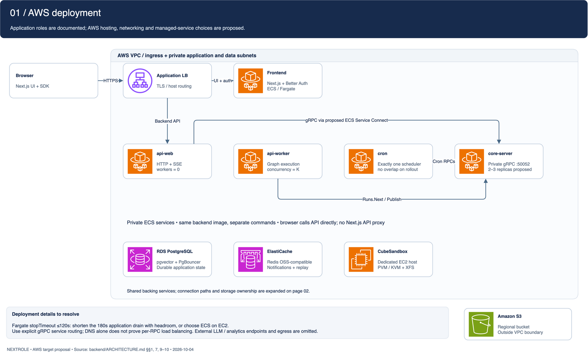

# NextRole backend on AWS

[Open the editable five-page draw.io file](backend-aws.drawio).

These diagrams translate [backend/ARCHITECTURE.md](../../../backend/ARCHITECTURE.md)
into an **AWS target proposal**, not an inventory of deployed infrastructure.
Application roles and flows come from that document; AWS hosting and managed-service choices
are design mappings. Source was reviewed on 2026-10-04.

| Page | Preview | Source sections |
| --- | --- | --- |
| 01 | [AWS deployment](01-deployment.png) | 1, 7, 9–10 |
| 02 | [Data ownership and persistence](02-data-ownership.png) | 1, 3, 6, 8–10 |
| 03 | [Run execution and queue](03-run-execution.png) | 4, 6, 9–10 |
| 04 | [Live streaming and bounded replay](04-streaming.png) | 5, 8–9 |
| 05 | [Authentication and per-user storage](05-authentication.png) | 8–10 |



## AWS mapping and boundaries

- ECS/Fargate hosts frontend, api-web, api-worker, cron and core-server as separate services.
  All backend roles share an image; the frontend has its own image. Keep exactly one cron
  process, including during deployments. Disable cron on web and worker replicas.
- An Application Load Balancer routes public HTTPS to frontend or api-web. The browser calls
  the backend directly; Next.js does not proxy the agent API. The overview groups VPC resources
  without prescribing availability-zone placement, route tables or security-group rules.
- ECS Service Connect is a proposed way to route internal gRPC to core-server replicas.
  Its proxy and Cloud Map configuration must be provisioned; plain DNS discovery does not
  establish per-RPC balancing. See [AWS Service Connect documentation](https://docs.aws.amazon.com/AmazonECS/latest/developerguide/service-connect.html).
- RDS PostgreSQL replaces local Postgres; validate the selected engine version, region and
  pgvector extension before provisioning. PgBouncer is a separate proposed connection-pooling
  component, not an RDS feature. Both core-server and API/worker direct database pools count
  toward the connection budget.
- ElastiCache with a compatible Redis engine replaces local Redis. Validate the selected
  engine/topology against the app's lists, pub/sub, Streams and locking commands. No Redis
  persistence setting turns it into the application's system of record.
- S3 replaces SeaweedFS through `OBJECT_STORE_*`. The bucket is a regional AWS service outside
  the VPC boundary. Provision bucket encryption, versioning and access controls separately.
- CubeSandbox maps to a dedicated EC2 Linux host, separate from Fargate. The host requires
  the PVM kernel path or native KVM on suitable bare metal, plus XFS. This is a hosting proposal,
  not a verified instance-type compatibility claim. See the
  [CubeSandbox deployment guide](../../../deploy/cubesandbox/README.md).
- Provider APIs, analytics dependencies, outbound routing, image registry and operational
  tooling are outside these focused backend views. No Cognito, SQS, Lambda or Bedrock migration
  is implied; the existing auth, database queue and model-provider configuration remain the basis.

## Deployment caveats carried into the diagrams

AWS Fargate caps container `stopTimeout` at **120 seconds**, while the architecture document
specifies a **180-second** application drain default. Set a shorter application grace period
with shutdown overhead inside the platform timeout, or use ECS on EC2 with a suitable timeout.
This requires deployment configuration and shutdown testing; the diagram does not establish
that existing settings work unchanged. See
[AWS Fargate task parameters](https://docs.aws.amazon.com/AmazonECS/latest/developerguide/task_definition_parameters.html).

A hard-killed worker can leave a run stuck in `running`; the documented sweeper is a no-op.
Pending runs are durable Postgres rows, and Redis only rings the queue doorbell. Stream replay
covers approximately 8192 structural entries for seven days; token chunks are live-only.
Postgres remains the source for saved graph state after the replay window expires.

Auth is opt-in. The multi-user view assumes it is enabled, with owner checks in core-server,
thread access gates for state/checkpoints and call-time identity scoping for KV and objects.
The frontend supplies Better Auth JWTs; AWS IAM controls infrastructure access, not application
resource ownership. Restrict unauthenticated meta routes and disable MCP/A2A until resource
authorization is audited. Use remote sandboxes for untrusted shell execution.

## Editing and validation

Open `backend-aws.drawio` in draw.io Desktop or diagrams.net and select a page tab. Cards,
AWS icons, connectors and text are native editable objects. The uncompressed XML is the
canonical local source; PNGs are previews. Nothing is stored in or synchronized with Eraser.

The pages were exported with draw.io Desktop 31.7.0 and visually inspected. Structural
validation reports no XML errors; its remaining overlap advisories are the intentional
sequence message anchors/text intersecting lifelines. The general semantic checker also
reports decorative labels as orphan nodes; it is not proof of deployment correctness.

To refresh one preview after editing (page numbers are 1-based):

```bash
DRAWIO_BIN=/Applications/draw.io.app/Contents/MacOS/draw.io
"$DRAWIO_BIN" -x -f png --width 2000 -p 1 \
  -o docs/diagrams/backend-aws/01-deployment.png \
  docs/diagrams/backend-aws/backend-aws.drawio
python3 .agents/skills/drawio-skill/scripts/validate.py \
  docs/diagrams/backend-aws/backend-aws.drawio --score
```

Update the other four page previews with their matching page numbers and filenames. Source
changes in `ARCHITECTURE.md` do not automatically synchronize the diagram.
