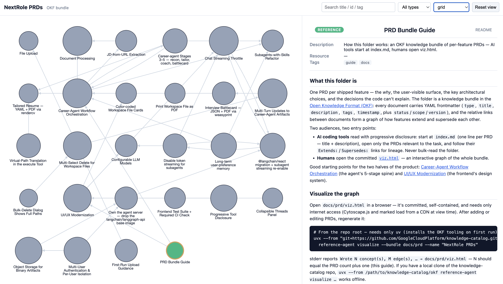

# What this folder is

One PRD per shipped feature — the *why*, the user-visible surface, the key architectural choices, and the decisions the code can't explain. The folder is a knowledge bundle in the [Open Knowledge Format (OKF)](https://github.com/GoogleCloudPlatform/knowledge-catalog/tree/main/okf): every document carries YAML frontmatter (`type`, `title`, `description`, `tags`, `timestamp`, plus `status`/`scope`/`version`), and the relative links between documents form a graph of how features extend and supersede each other.

Two audiences, two entry points:

- **AI coding tools** read with progressive disclosure: start at `index.md` (one line per PRD — title + description), open only the PRDs relevant to the task, and follow their `Extends:`/`Supersedes:` links for lineage. Never bulk-read the folder.
- **Humans** open the committed [`viz.html`](viz.html) — an interactive graph of the whole bundle.

Good starting points for the two halves of the product: [Career-Agent Workflow Orchestration](08_agent_workflow.md) (the agent's 5-stage spine) and [UI/UX Modernization](20_ui_modernization.md) (the frontend's design system).

# Visualize the graph

Open `docs/prd/viz.html` in a browser — it's committed, self-contained, and needs only internet access (Cytoscape.js and marked load from a CDN at view time). After adding or editing PRDs, regenerate it:

```bash
# From the repo root — needs only uv (installs the OKF tooling on first run):
uvx --from "git+https://github.com/GoogleCloudPlatform/knowledge-catalog.git#subdirectory=okf" \
  reference-agent visualize --bundle docs/prd --name "NextRole PRDs"
```

stderr reports `Wrote N concept(s), M edge(s), … → docs/prd/viz.html` — N should equal the PRD count plus one (this guide). If you have a local clone of the [knowledge-catalog repo](https://github.com/GoogleCloudPlatform/knowledge-catalog), `uvx --from /path/to/knowledge-catalog/okf reference-agent visualize …` works offline.



# How to read the graph

- **Nodes** are PRDs (gray) plus this guide (green). Node size tracks document length.
- **Arrows point at the PRD being built upon** — an edge exists for every `Extends:`/`Supersedes:` relation and every inline PRD mention.
- **Click a node** for the detail pane: description, tags, the rendered document, and a "Cited by" list of every PRD that links back to it.
- **Search** matches title, file id, and tags (try `streaming` or `superseded`); the type filter and layout switcher live in the toolbar.
- Superseded PRDs carry a `superseded` / `partially-superseded` tag and open with a banner naming their successor. Two nodes (Print-as-PDF, Frontend Test Suite) are genuinely standalone — isolated nodes are honest, not missing links.

# The format contract

- **Filenames**: `NN_snake_case.md`, zero-padded, next number in sequence.
- **Frontmatter** (order: `type, title, description, tags, timestamp`, then extensions): `type: PRD` plain; `title`/`description`/`status`/`scope` always double-quoted; `timestamp` single-quoted ISO 8601 with offset; `tags` a flow list of lowercase words; `version` plain (`v1`, `v2`, …).
- **Relations line** at the top of the body where applicable: `**Extends:** [Title](NN_feature.md)` / `**Supersedes:** …` — targets are *relative* links, which is what draws the graph edges. Links out of this folder (repo docs, GitHub URLs) are fine but never become edges.
- **Body sections at H1**, in the write-prd template order. No H1 title in the body — the title lives in frontmatter.
- **This folder is bundle-only.** Any stray `.md` dropped here becomes a graph node. Never create `log.md` here, and never add frontmatter to `index.md` — both names are reserved by OKF. Example links inside code fences use placeholder targets (like `NN_feature.md` above) because the edge scanner reads fences too.

# Adding or updating a PRD

1. Run `/write-prd` — the skill emits this format and proposes the next `NN_` filename.
2. Add the PRD's line to `index.md` (title-alphabetical within the `# PRD` section, description copied from frontmatter). To rebuild the index from scratch instead:

   ```bash
   uvx --from "git+https://github.com/GoogleCloudPlatform/knowledge-catalog.git#subdirectory=okf" \
     python -c "from pathlib import Path; from reference_agent.bundle.index import regenerate_indexes; regenerate_indexes(Path('docs/prd'))"
   ```

3. Regenerate `viz.html` (command above) — expect the concept count to go up by one.
4. Superseding an old PRD? Give the new one a `**Supersedes:**` line, and flip the old one's `status`, add the `superseded` tag, and open its body with a banner blockquote — `16_disable_subagent_streaming.md` / `18_langchain_react_migration.md` are the worked pair.
