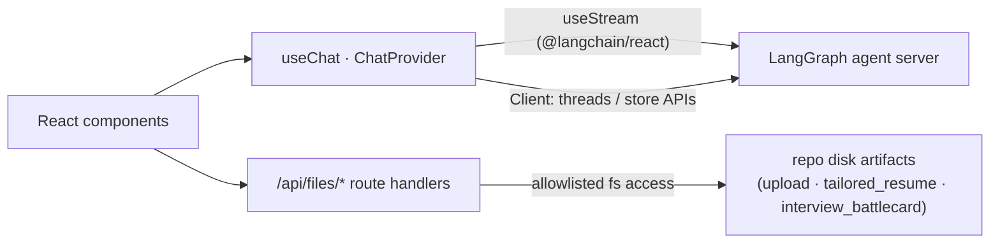

# NextRole Frontend

The chat + live-workspace UI for NextRole's multi-agent backend: **Next.js 16 (App Router, Turbopack) · React 19 · TypeScript · Tailwind 4**, streaming from LangGraph via `@langchain/react`.


## What it does

- 💬 **Streaming chat** with the career agent — token streaming, tool-call boxes with live arg previews, and nested **subagent activity cards** (`ChatInterface`, `ToolCallBox`, `SubagentCard`).
- 🗂️ **Live workspace** beside the chat — the agent's plan (todos), produced artifacts, and research sources update as the run progresses (`Workspace`, `workspace/*`, `TasksFilesSidebar`).
- ✋ **Human-in-the-loop approvals** — when the agent pauses on a protected tool call, approve / edit / reject inline (`ToolApprovalInterrupt`).
- 📄 **File preview & editing** — markdown, code, images, and `.docx` (via `mammoth`) in a dialog with edit-and-save, plus a dedicated **print-to-PDF** route (`FileViewDialog`, `/print/file`).
- 🔗 **File-linkified markdown** — agent replies mentioning `/processed/cv.md` become clickable links straight into the preview (`MarkdownContent` + the `remarkFilePaths` plugin).
- 🧵 **Threads drawer** — slide-over history, pinnable to a docked column; thread selection lives in the URL (`nuqs`), so runs are shareable/bookmarkable.
- ⚙️ **Runtime configuration** — deployment URL, assistant, and main/subagent models are set in-app and persisted to `localStorage`; no rebuild to swap LLMs (`ConfigDialog`).
- 🎨 **Theming** — light/dark via `next-themes` plus a user-selectable accent (`data-accent` on `<html>`); the design system is specified in [`DESIGN.md`](DESIGN.md).

## How it talks to the backend



- **Streaming**: `useChat` (`src/app/hooks/useChat.ts`) wraps `@langchain/react`'s `useStream` v2 runtime — messages, values, interrupts, and per-subagent channels — and exposes it app-wide through `ChatProvider`.
- **Data**: the LangGraph SDK `Client` (created once in `ClientProvider`) serves thread history (`useThreads` + SWR) and the Postgres-backed store files; text artifacts live there.
- **Disk artifacts** (binary uploads, rendered PDFs) are read/written through the app's own `/api/files/{list,read,write,upload,delete}` route handlers, which resolve paths against a strict allowlist (`src/app/api/files/_lib.ts`) — path traversal is rejected server-side.
- Agent-file routing (which store a given virtual path belongs to) is configured in `src/app/config/agentFiles.ts`.

## Layout

```
src/
├── app/
│   ├── page.tsx              # Two resizable panels (chat + workspace), threads drawer, config gate
│   ├── api/files/            # Disk-artifact route handlers + allowlist (_lib.ts)
│   ├── print/file/           # Standalone print-to-PDF page (reads a sessionStorage payload)
│   ├── components/           # Chat, workspace, dialogs (tests colocated as *.test.tsx)
│   ├── hooks/                # useChat (streaming + file CRUD), useThreads (SWR pagination)
│   ├── lib/ · utils/         # File categories/sources, upload client, parsers, remark plugin
│   └── config/               # Agent file-source routing table
├── providers/                # Client, Chat, FilePreview, Accent, Theme
├── components/ui/            # shadcn/Radix primitives
└── lib/                      # Runtime config (env defaults + localStorage overrides)
```

## Development

The normal path is the root [Quick Start](../README.md#quick-start) — `docker compose up -d` runs everything, and source edits hot-reload into the container. To run the frontend directly on the host instead:

```bash
nvm use              # Node 24 (.nvmrc)
pnpm install
pnpm dev             # Turbopack dev server
```

Configuration comes from `NEXT_PUBLIC_*` env vars (see [`.env.example`](../.env.example)) or the in-app Configuration dialog (which wins, via `localStorage`):

| Variable                               | Purpose                                       |
| -------------------------------------- | --------------------------------------------- |
| `NEXT_PUBLIC_LANGGRAPH_DEPLOYMENT_URL` | Agent server URL (the backend's host port)    |
| `NEXT_PUBLIC_LANGGRAPH_ASSISTANT_ID`   | Assistant/graph id (`career_agent`)           |
| `NEXT_PUBLIC_LANGSMITH_API_KEY`        | Optional — only for authenticated deployments |

Everyday scripts (pnpm only — the version is pinned via `packageManager`):

| Command                                                | What it does                                          |
| ------------------------------------------------------ | ----------------------------------------------------- |
| `pnpm dev` / `pnpm build` / `pnpm start`               | Turbopack dev server / production build / serve       |
| `pnpm test` / `pnpm test:watch` / `pnpm test:coverage` | Vitest suite (what CI runs) / watch / v8 coverage     |
| `pnpm lint:fix` · `pnpm format` · `pnpm type-check`    | ESLint · Prettier · `tsc --noEmit`                    |
| `pnpm quality`                                         | lint + format + type-check + SDK-sync check in one go |

## Testing

Vitest 4 + React Testing Library. Tests are **colocated** with their source; the extension picks the environment — `.test.ts` runs in node (pure modules, the `/api/files/*` handlers against a real temp-dir sandbox), `.test.tsx` in jsdom (hooks, providers, components). The suite is a required CI check (`frontend-tests`) and never touches the network.

Conventions, mocking rules, and gotchas live in [`CLAUDE.md`](CLAUDE.md#testing); the contributor workflow is in the root [`CONTRIBUTING.md`](../CONTRIBUTING.md#testing).

## Related docs

- [`CLAUDE.md`](CLAUDE.md) — stack conventions: tooling, style, testing, and the `@langchain/react` ↔ `@langchain/langgraph-sdk` lockstep upgrade rule.
- [`DESIGN.md`](DESIGN.md) — the design system: tokens, typography, spacing, and per-component specs.
- [Root README](../README.md) — product overview, architecture, and quick start.
